class: center, middle, inverse
background-image: url(https://www.unomaha.edu/university-communications/downloadables/campus-icon-the-o/uno-icon-color.png)
background-position: 95% 90%
background-size: 10%

# Sampling

<br>
<br>
<br>

[Justin Nix](https://jnix.netlify.app)  
*School of Criminology and Criminal Justice*  
*University of Nebraska Omaha*

<br>
<br>
<br>
<br>
<br>
.white[February 29, 2024]

---
class: middle, center, inverse

# To start, let's reflect
# on some of the following polls

---
class: middle

<iframe title="Americans' Confidence in Institutions" aria-label="Interactive line chart" id="datawrapper-chart-pLzzH" src="https://datawrapper.dwcdn.net/pLzzH/1/" scrolling="no" frameborder="0" style="width: 0; min-width: 100% !important; border: none;" height="400" data-external="1"></iframe><script type="text/javascript">!function(){"use strict";window.addEventListener("message",(function(e){if(void 0!==e.data["datawrapper-height"]){var t=document.querySelectorAll("iframe");for(var a in e.data["datawrapper-height"])for(var r=0;r<t.length;r++){if(t[r].contentWindow===e.source)t[r].style.height=e.data["datawrapper-height"][a]+"px"}}}))}();
</script>

???

Gallup did its first *Confidence in Institutions* poll in 1973, and has been doing it annually since 1993 (usually in June). Here's the question:

*Please tell me how much confidence you, yourself, have in each one --* ***a great deal***, ***quite a lot***, ***some*** or ***very little?***

Gallup asks roughly 1,000 adults from all 50 states and Washington, DC. 

**What jumps out at you when you look at the last 30 years of data?**

- Confidence in *everything* has fallen since the pandemic started. 
- Only *small business* and *the military* inspire a great deal/quite a lot of confidence in the **majority** of Americans. 
- For all their problems, the police inspire more confidence than CJ system as a whole, the president, congress, the media, and the medical system
  - That said, confidence in the police has been trending downward pretty steadily since 2004. 

---
class: middle

```{r, echo=FALSE, fig.align='center', out.width = "80%"}
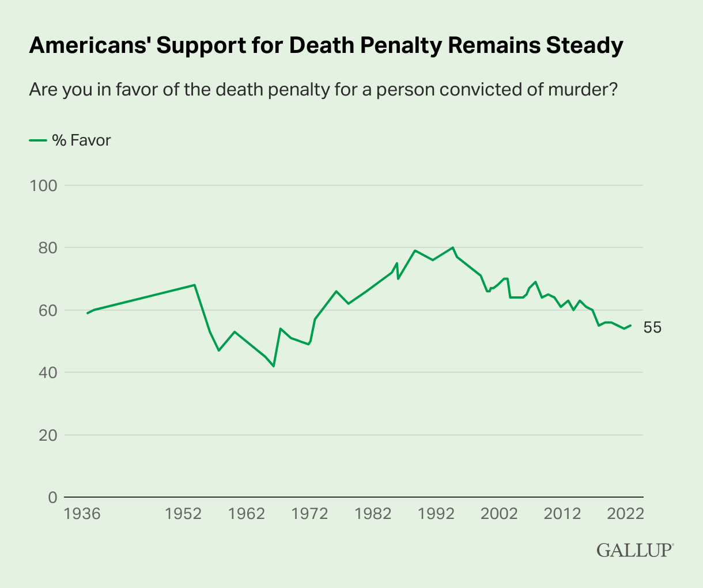
```
<p style="text-align: center; color: gray">.small[click [here](https://news.gallup.com/poll/404975/steady-americans-support-death-penalty-murderers.aspx) for more]</p>

???

Here's another Gallup poll that asks Americans: *are you in favor of the death penalty for a person convicted of murder?*

**What do you see?**

- A majority still support the use of capital punishment. 
  - However, support is down significantly from the early 1990s, when it hovered around 80%. 
  - Interestingly, that coincides with when the national homicide rate was at its highest. 
  - And the increase from the late 60s to the early 90s coincides with rising violent crime rates.
  
- Note there was a moratorium imposed in 1972 following SCOTUS' decision in *Furman v. Georgia*. 
  - Concerns about racial discrimination, cruel and unusual punishment.
  - It lasted until 1976 (*Gregg v. Georgia*)

---
class: middle

```{r, echo=FALSE, fig.align='center', out.width = "90%"}
knitr::include_graphics("skeptic-poll.png")
```
<p style="text-align: center; color: gray">.small[click [here](https://www.skeptic.com/research-center/reports/Research-Report-CUPES-007.pdf) for more]</p>

???

This poll was done by **Skeptic Research Center**, as part of its *Civil Unrest and Presidential Election Study* in September/October of 2020. 
- 980 U.S. adults "from the CUPES dataset"

**Does anybody know what the correct number is?**

---
class: middle

```{r, echo=FALSE, fig.align='center', out.width = "90%"}
knitr::include_graphics("goldberg.jpg")
```
<p style="text-align: center; color: gray">.small[click [here](https://media4.manhattan-institute.org/wp-content/uploads/what-americans-get-wrong-about-police-violence.pdf) for more]</p>

???

This comes from a study by Zach Goldberg in February 2023. He surveyed 1500 US adults on "Prolific." Not a random sample, but stratified by age, sex, and ethnicty to mirror the US population on those variables. 

On the left, where averages are shown, you can see there are some EXTREME outliers skewing things. 

On the right, the medians actually suggest Americans underestimate the prevalance of fatal police shootings, with liberals being closest to "correct" despite the median being half of the true number. 

---
class: middle

```{r, echo=FALSE, fig.align='center', out.width = "90%"}
knitr::include_graphics("goldberg2.jpg")
```
<p style="text-align: center; color: gray">.small[click [here](https://media4.manhattan-institute.org/wp-content/uploads/what-americans-get-wrong-about-police-violence.pdf) for more]</p>

???

This comes from a study by Zach Goldberg in February 2023. He surveyed 1500 US adults on "Prolific." Not a random sample, but stratified by age, sex, and ethnicty to mirror the US population on those variables. 

Note that the bottom row reflects the true percentages (per WAPO)

On the left, you can see every group overestimates Black and Asian representation in fatal police shootings, and underestimates white representation. 

On the right, every group overestimates the % of EVERY racial group that was unarmed when fatally shot. 

---
class: middle

```{r, echo=FALSE, fig.align='center', out.width = "80%"}
knitr::include_graphics("animal-fights.png")
```
<p style="text-align: center; color: gray">.small[click [here](https://yougov.co.uk/topics/society/articles-reports/2021/05/21/which-animals-could-britons-beat-fight) for more]</p>

???

This one comes from YouGov - they surveyed ~1200 Americans in April 2021 and ~2000 Britons in May 2021.

**What do you see?**

- It looks to me like ~5% of Britons and ~12% of Americans either:
  - Trolled
  - Did not read the question (i.e., missed the "unarmed" bit)
  - Vastly overestimated their fighting prowess
  
- Also, way too many people on both sides of the pond are underestimating geese. 

- Also, 1 in 3 people don't think they could win a fight against a rat???

---
class: middle, center, inverse

# You buying all these?

--

## Why or why not? 

???

Remember, we want **valid** results.
- Do you trust that the *Skeptic* poll is as generalizable as the *Gallup* polls? 
  - It might be! But it's very hard to evaluate its external validity, given the lack of information about how the sample was selected. 
  
Sample planning is a first-order concern when doing criminological research. It's not the only concern - i.e., we could nitpick question wording, or we might wonder about response rates. But without knowing how a sample was selected, it's very difficult to know what to make of results like these. 

---
class: middle, center, inverse

# Sample planning

---
class: top

# Sample planning

--

## Define sample components and the population

--

Let's say we're curious what today's high school students' career aspirations are...

???

Any guesses as to how many high school students there are in the United States? 

- 16-17 million as of 2021

--

We don't have the time or resources to survey this entire **population**

```{r, echo=FALSE, fig.align='center', out.width = "20%"}

```

???

More often than not, we can't survey the entire population. That'd be a *census* (more on that in a moment). 
- Expensive. Time consuming. Sometimes impossible because we can't define the population. 

So as researchers we should be clear at the outset what the **population for our research is**. We may wish to generalize to some larger group, but we have to be careful. 

---
class: top

# Sample planning

## Define sample components and the population

--

So we set our sights on *Nebraska* high school students' career aspirations...

???

Even surveying the population of Nebraska high school students would be very difficult - any guesses how many high schoolers are in Nebraska?

According to [NE Dept. of Education](https://www.education.ne.gov/wp-content/uploads/2022/02/Statsfacts_20212022.pdf), in 2021-22, there were 262 public schools in Nebraska that include grades 9-12 (95 "high schools" and 167 "secondary schools"). 

- And together, these schools had **~105,000 students** enrolled.

--

Still ambitious - we'll still need to draw a **sample**!

```{r, echo=FALSE, fig.align='center', out.width = "60%"}
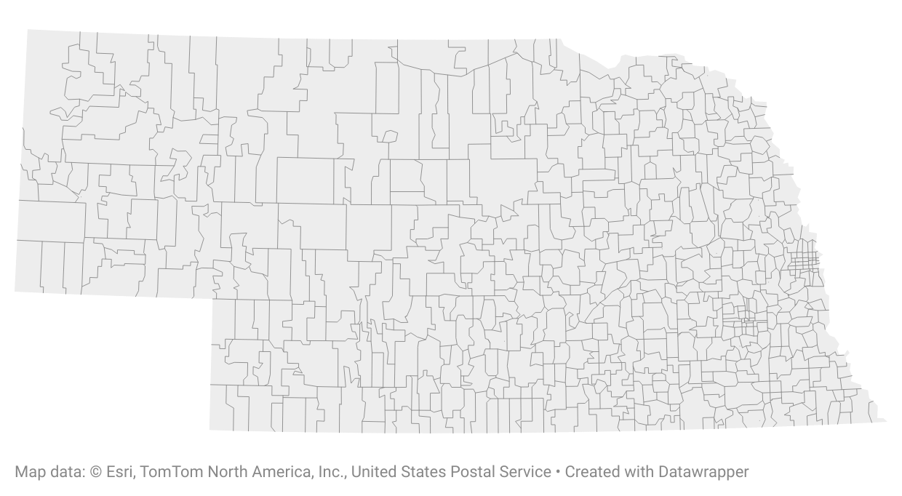
```

???


---
class: top

# Sample planning

## Define sample components and the population

So we set our sights on *Nebraska* high school students' career aspirations...

Still ambitious - we'll still need to draw a **sample**!

```{r, echo=FALSE, fig.align='center', out.width = "60%"}
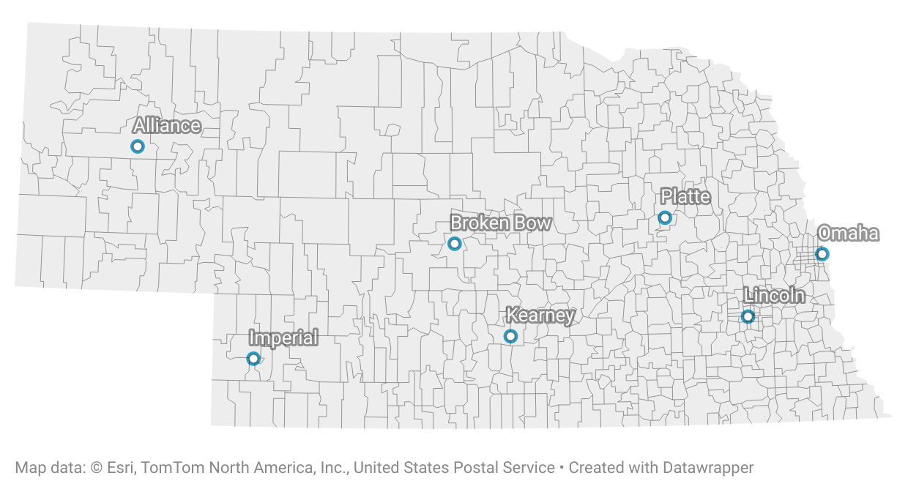
```

???

Even surveying the population of Nebraska high school students would be very difficult. 

So perhaps we resolve to survey *public high school* students at a random sample of schools in these 7 cities/towns. 
- We *purposely* select these places for various reasons
  - Access
  - Spread out geographically across the state
  - Represent urban and rural areas
- Note that this means the study we carry out may not produce findings that are generalizable to private school students. We'll have no way to know. 

The students enrolled in those schools from which we draw our sample is the **sampling frame**. 

---
class: top

# Sample planning

## Define sample components and the population

--

```{r, echo=FALSE, fig.align='center', out.width = "58%"}
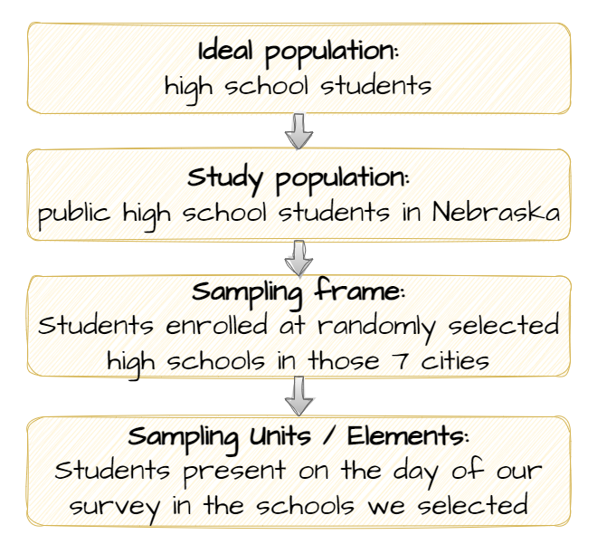
```

???

I think your book calls the "ideal" population the "target" population. The key point here is that we have to be careful not to conflate it with the *actual* population that we sampled from. In this case, we didn't sample from all high school students. We sampled from students attending public high schools in Nebraska. 

Now that we've identified our sampling frame, we try to survey all students within. 
- Inevitably, some students will be absent on the day(s) we administer our survey. 
- And inevitably, some students who are present won't complete our survey. 
- The surveys returned from those who completed the survey will constitute the data we use to answer our research question (what are high school students' career aspirations?)
  - We'll have to be cognizant of the threat of *nonresponse bias*. More on that later. 

---
class: top

# Sample planning

--

## Evaluate generalizability

--

Key question: how much **sampling error**?

```{r, echo=FALSE, fig.align='center', out.width = "40%"}

```

???

**Sampling error** is the difference between characteristics of the sample and characteristics of the population from which it was selected.

The larger the sampling error, the less representative the sample, and thus the less generalizable our findings. 

Ask yourself these 3 questions:

1. From what population were cases selected?
2. What *method* was used to select those cases?
3. DO the cases that were studied represent - in the aggregate - the population from which they were selected? 

---
class: top

# Sample planning

--

## Assess population diversity

If all units in the population were identical, there'd be no need to sample

--

- e.g., physicists don't need to sample atomic particles

```{r, echo=FALSE, fig.align='center', out.width = "10%"}
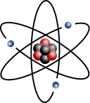
```
<p style="text-align: center; color: gray">.small[[Image](https://commons.wikimedia.org/wiki/File:Stylised_atom_with_three_Bohr_model_orbits_and_stylised_nucleus.svg) by [Indolences](https://commons.wikimedia.org/wiki/User:Indolences), [CC BY-SA 3.0](https://creativecommons.org/licenses/by-sa/3.0/)]</p>

--

But, as the great Ted Lasso noted:

> *All people are different people.*

???

Physicists don't need a sample of atomic particles to learn about basic physical properties. 

This is what makes social science so tricky. We **do** have to sample. And it can be very difficult. 

Ultimately the goal of sampling is to study a *representative* subset of the population we're interested in. 
- In other words, it looks like the population from which it was drawn in all respects that are potentially relevant to our study. 
- The distribution of characteristics among our sample elements are the same as in the total population. 

If our sample is unrepresentative, some characteristics are over- or under-represented in our sample, and this can introduce **sampling error**, which can skew our results. 

---
class: top

# Sample planning

--

## Consider a census

???

In some situations you can bypass concerns about generalizability by studying your entire population of interest. 
- Much like the federal government does every 10 years with its US Census. 

So, e.g., all employees in an organization or all students in a university. 

Obviously, with large populations, this quickly becomes daunting. 

--

For example: you might send a survey to **all 228 law enforcement agencies** in Nebraska

```{r, echo=FALSE, fig.align='center', out.width = "65%"}
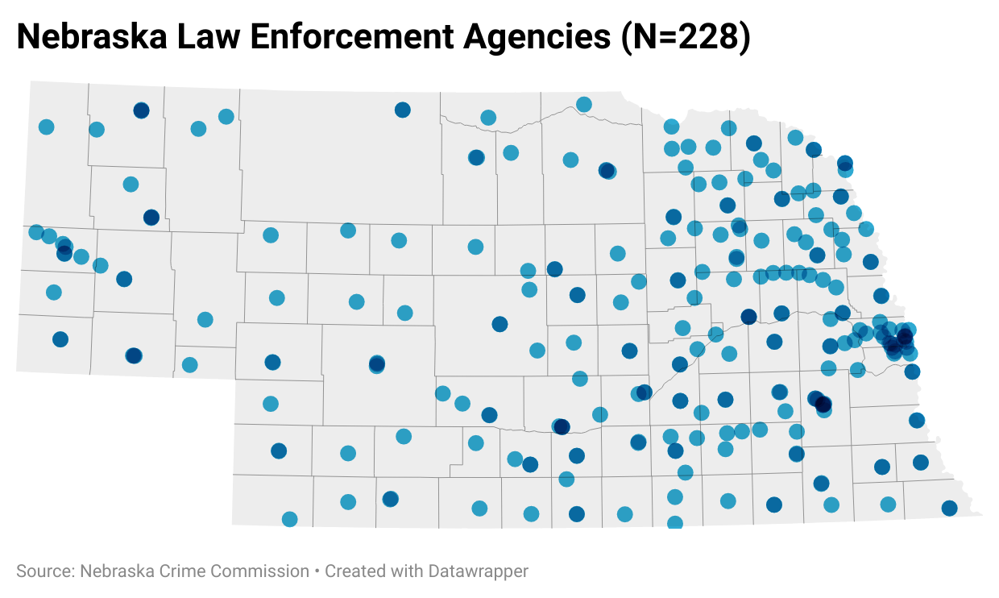
```

---
class: middle, center, inverse

# Sampling methods

---
class: top

# Sampling methods

--

## Probability sampling methods

--

### Simple random sampling

--

```{r, echo=FALSE, fig.align='center', out.width = "65%"}
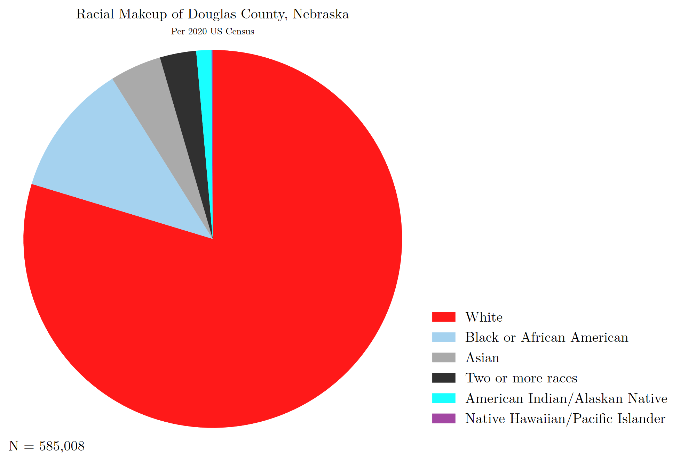
```

???

Douglas county is:
- 80% white
- 11% black
- 1% American Indian/Alaskan Native
- 4.5% Asian
- Less than 1% Native Hawaiian/PI
- 3% two or more races

---
class: top

# Sampling methods

## Probability sampling methods

### Simple random sampling

--

```{r, echo=FALSE, fig.align='center', out.width = "65%"}
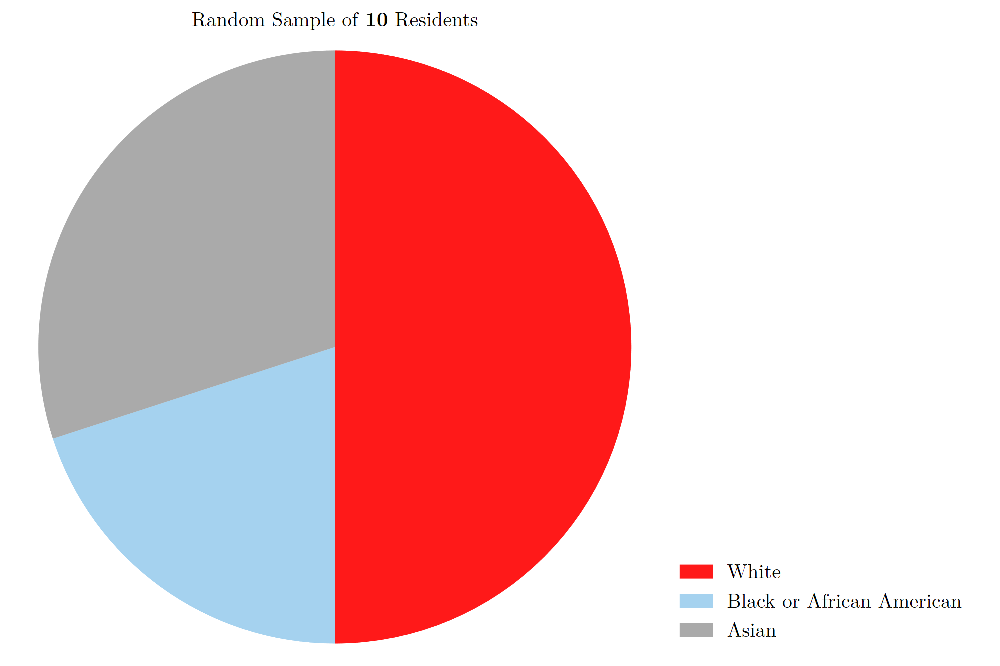
```

---
class: top

# Sampling methods

## Probability sampling methods

### Simple random sampling

--

```{r, echo=FALSE, fig.align='center', out.width = "65%"}
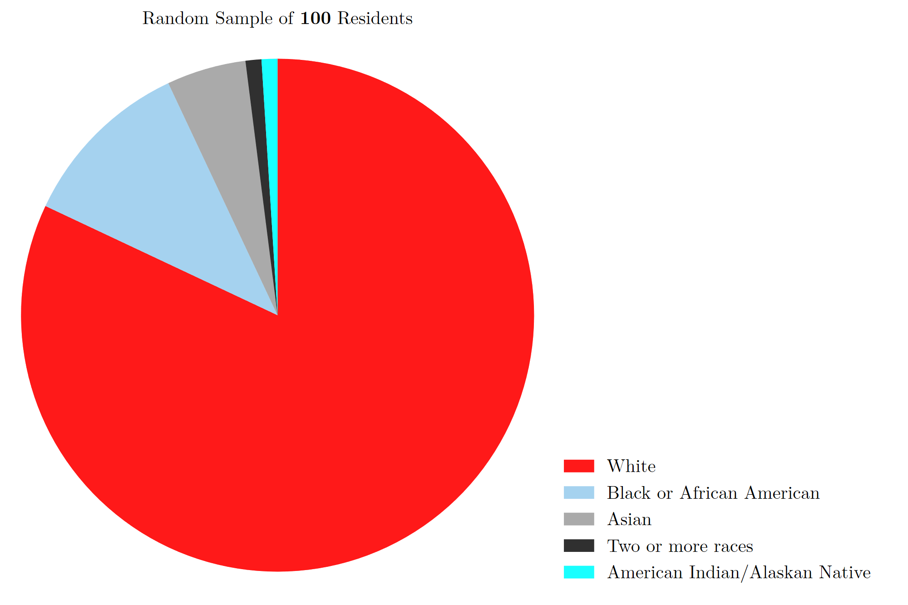
```

---
class: top

# Sampling methods

## Probability sampling methods

### Simple random sampling

--

```{r, echo=FALSE, fig.align='center', out.width = "65%"}
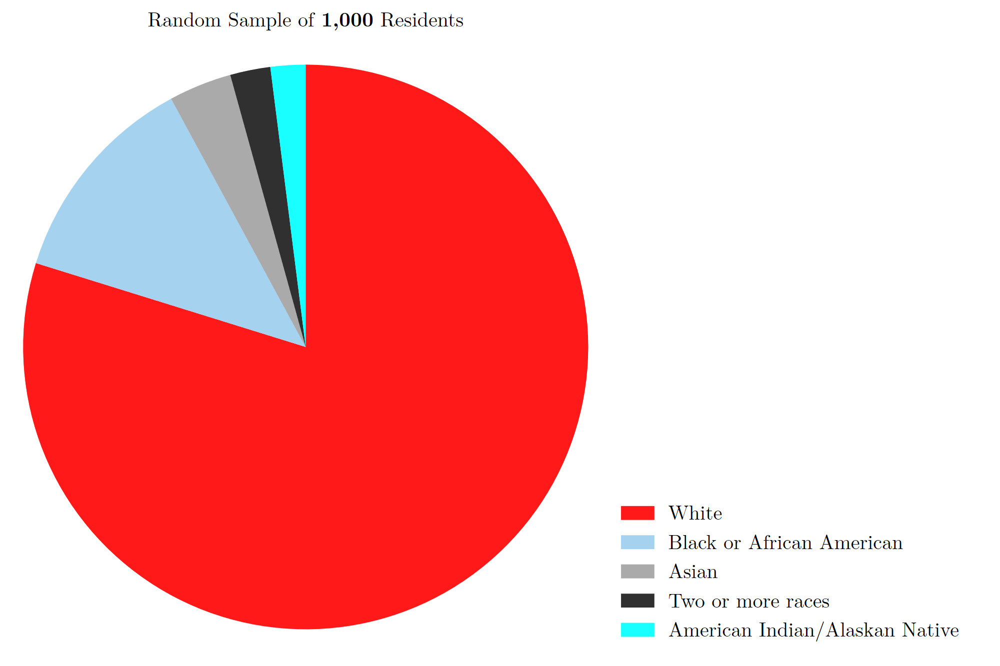
```

---
class: top

# Sampling methods

## Probability sampling methods

--

### Systematic random sampling

--

Let's say we have a population, ***N***, of 1000, and we want to draw a random sample, ***n***, of 20. 

--

Our *systematic sampling interval*, or ***k***, is:

$k = N/n$

--

So here, we'd [pick a number at random](https://www.google.com/search?q=random+number+generator) between 1 and 50 as the starting point, then select every 50th observation

--

***NOTE***: *This won't work if the data are sorted in some meaningful way!*

---
class: top

# Sampling methods

## Probability sampling methods

--

### Stratified random sampling

```{r, echo=FALSE, fig.align='center', out.width = "65%"}
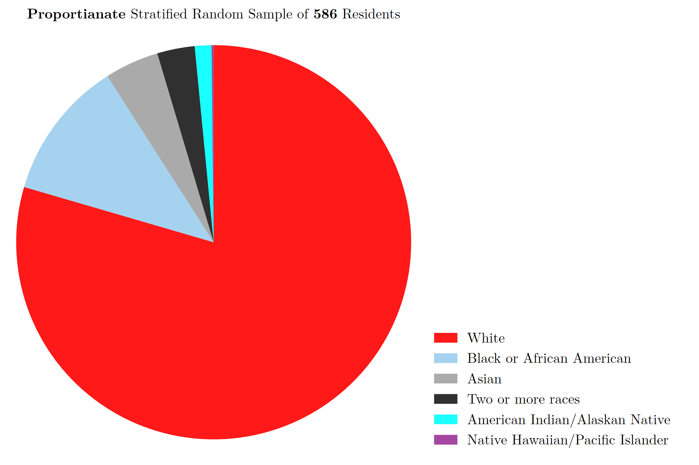
```

---
class: top

# Sampling methods

## Probability sampling methods

### Stratified random sampling

--

```{r, echo=FALSE, fig.align='center', out.width = "65%"}
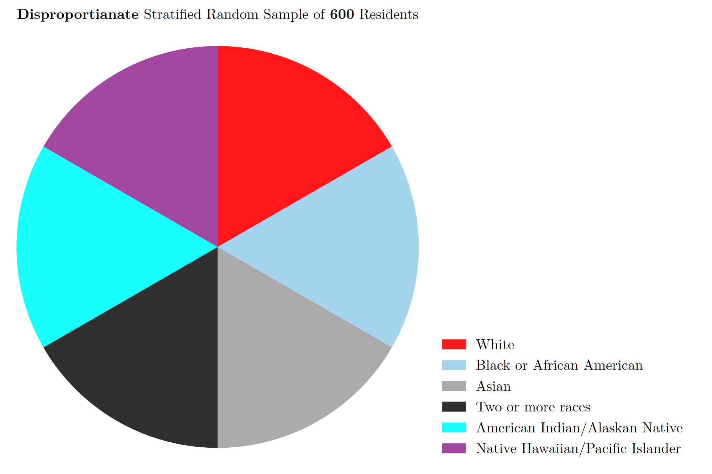
```


---
class: top

# Sampling methods

## Probability sampling methods

--

### Multistage cluster sampling

--

Useful when a sampling frame is not available

--

For example, the [National Crime Victimization Survey](https://bjs.ojp.gov/data-collection/ncvs)

```{r, echo=FALSE, fig.align='center', out.width = "70%"}
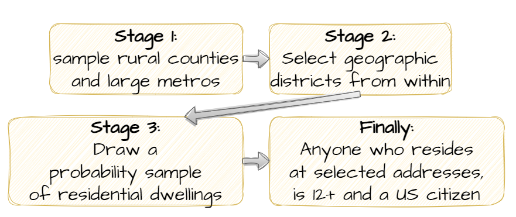
```

???

Randomly sample **clusters** of elements, then randomly sample the individual elements from the selected clusters

**NCVS**
1. primary sampling units are a sample of rural counties and large metropolitan areas
2. from there, NCVS samples geographic districts from within (according to Census Bureau)
3. then, a probability sample of residential dwellings is drawn
4. finally, anyone in the selected households who is 12+ and is a US citizen is eligible for the NCVS

- They select approximately 50,500 housing units each year

---
class: top

# Sampling methods

--

## Nonprobability sampling

--

### Availability sampling

```{r, echo=FALSE, fig.align='center', out.width = "55%"}

```
<p style="text-align: center; color: gray">.small[[Image](https://pxhere.com/en/photo/1443859) by [Bünyamin GÖV](https://pxhere.com/en/photographer/1212555)]</p>

---
class: top

# Sampling methods

## Nonprobability sampling

--

### Quota sampling

--

An improvement over mere availability sampling because you ensure the sample represents some characteristics in proportion to their prevalence in the population

--

The problem: no way to know if the sample is representative in terms of other characteristics

---
class: top

# Sampling methods

## Nonprobability sampling

--

### Purposive sampling

--

Target individuals who are particularly knowledgeable about the issue you're studying

--

For example: 

- [Weisburd et al. (1995)](https://doi.org/10.1111/j.1745-9125.1995.tb01191.x)  
  - People convicted of white-collar offenses in 7 federal judicial districts
  
- [Venkatesh (2008)](https://www.penguinrandomhouse.com/books/300406/gang-leader-for-a-day-by-sudhir-venkatesh/)  
  - Gang members and residents of the [Robert Taylor Homes](https://en.wikipedia.org/wiki/Robert_Taylor_Homes)

---
class: top

# Sampling methods

## Nonprobability sampling

--

### Snowball sampling

```{r, echo=FALSE, fig.align='center', out.width = "60%"}

```

---
class: top

# Sampling methods

--

## Lessons about sample quality

--

1. We can't evaluate a sample's quality if we don't know what population it is meant to represent.

--

2. ...Or if we don't know exactly how cases in the sample were selected.

--

3. Sample quality is determined by the sample *actually obtained*, not just by the method itself.

--

4. Pay attention: researchers sometimes talk about the implications of their findings for some group larger than (or just different from) the population they actually sampled. 

---
class: middle, center, inverse

# Units of analysis and errors in causal reasoning

---
class: top

# Units of analysis and errors in causal reasoning

--

## Individual and group units of analysis

--

Be careful to distinguish **units of analysis** and **units of observation**

--

For example: [Sampson et al. (1997)](https://www.science.org/doi/full/10.1126/science.277.5328.918)

```{r, echo=FALSE, fig.align='center', out.width = "90%"}
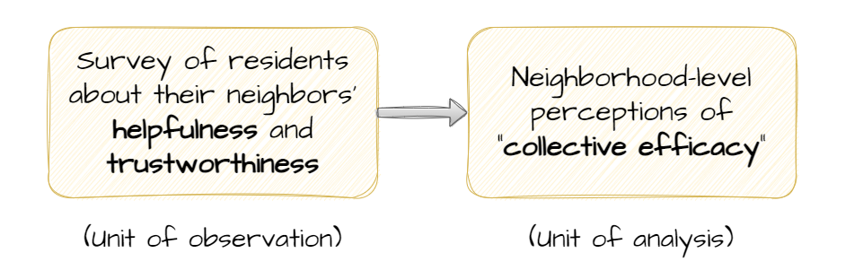
```

---
class: top

# Units of analysis and errors in causal reasoning

--

## The ecological fallacy

--

Drawing conclusions about individual-level processes from group-level data

```{r, echo=FALSE, fig.align='center', out.width = "80%"}
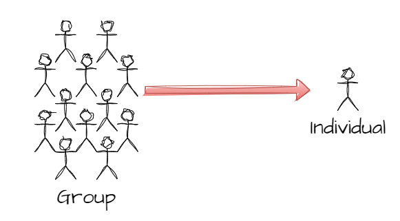
```

---
class: top

# Units of analysis and errors in causal reasoning

--

## Reductionism

--

Drawing conclusions about group-level processes from individual-level data

```{r, echo=FALSE, fig.align='center', out.width = "80%"}

```

---
class: middle, center, inverse 

```{r, echo=FALSE, fig.align='center', out.width = "63%"}
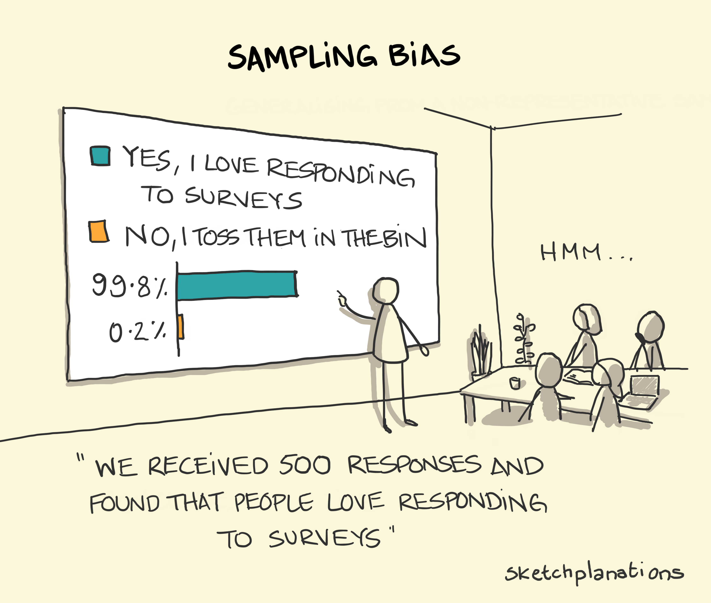
```
<p style="text-align: center; color: gray">.small[Credit: [Sketchplanations](https://sketchplanations.com/)]

# Have a great day! 😄

<!-- ```{css, echo=FALSE} -->
<!-- @media print { -->
<!--   .has-continuation { -->
<!--     display: block; -->
<!--   } -->
<!-- } -->
<!-- ``` -->

<style>
p.caption {
  font-size: 0.5em;
  color: lightgray;
}
</style>