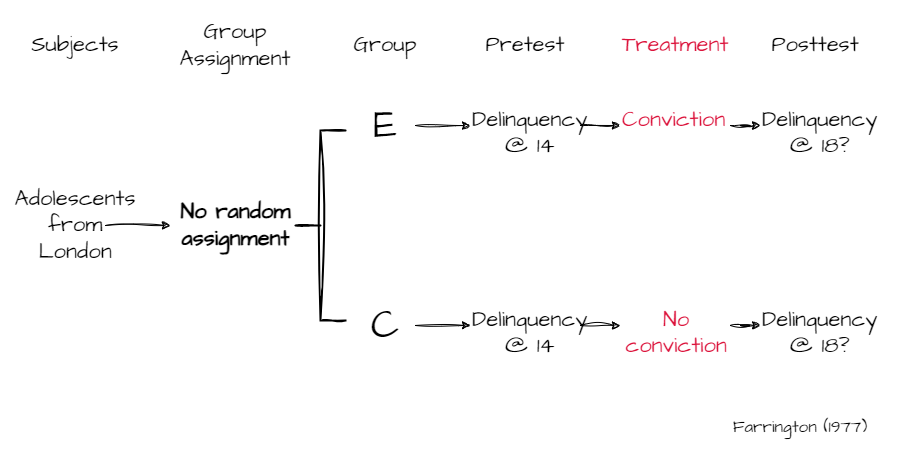
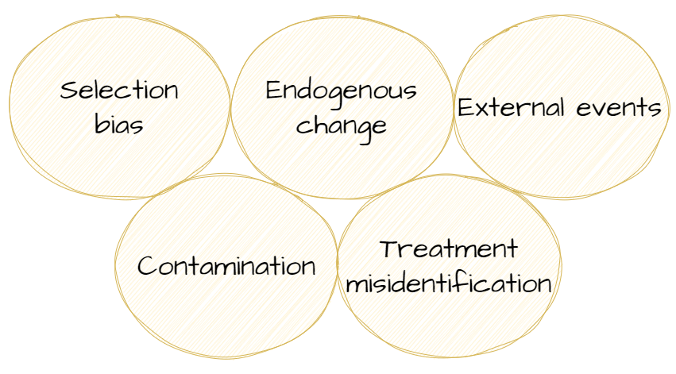
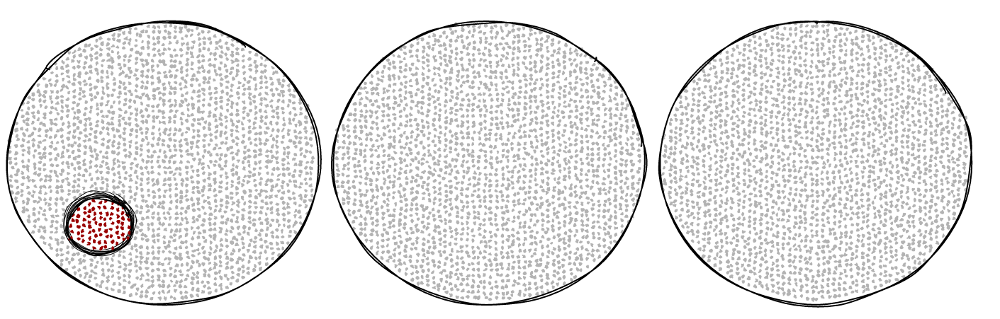
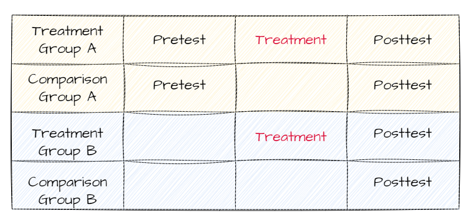
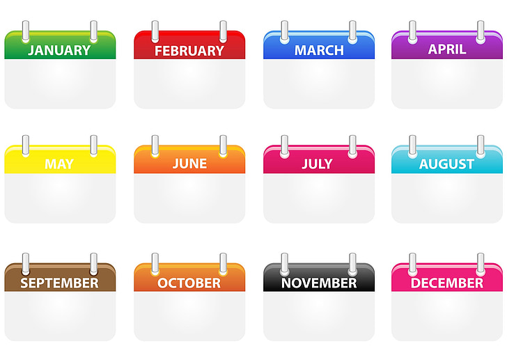
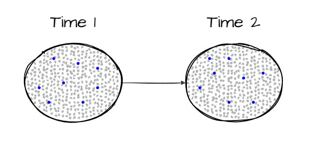
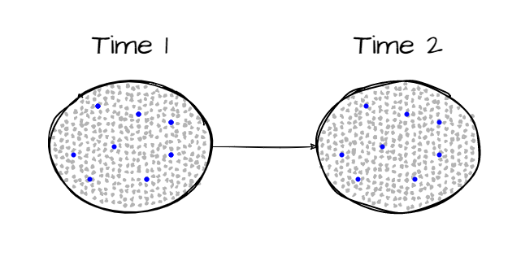
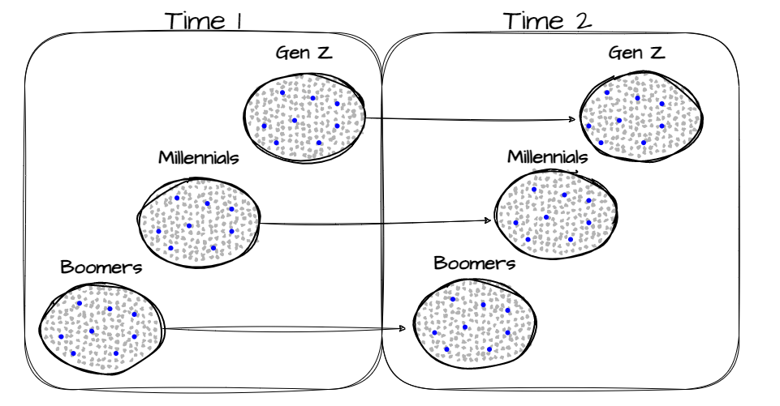
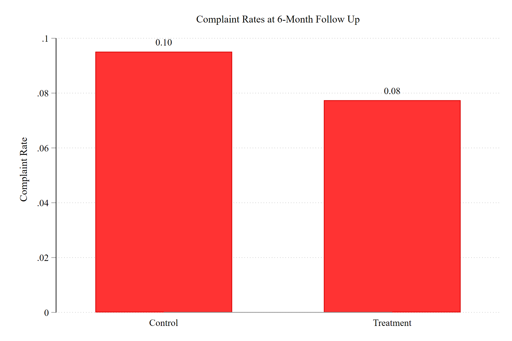
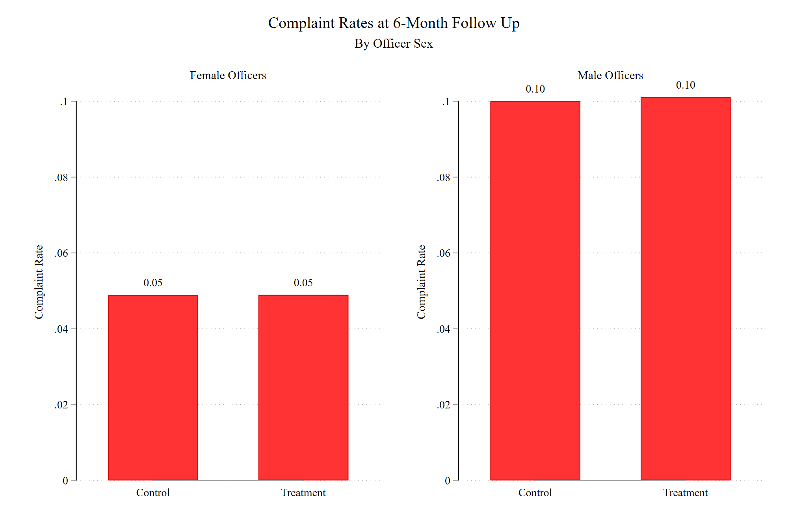

class: center, middle, inverse
background-image: url(https://www.unomaha.edu/university-communications/downloadables/campus-icon-the-o/uno-icon-color.png)
background-position: 95% 90%
background-size: 10%

# Causation and Research Design

<br>
<br>
<br>

[Justin Nix](https://jnix.netlify.app)  
*School of Criminology and Criminal Justice*  
*University of Nebraska Omaha*

<br>
<br>
<br>
<br>
<br>
.white[October 10, 2024]

---
class: middle, center, inverse

# $X$ → $Y$

???

This chapter is all about causes and effects. 

In the social sciences, demonstrating **causality** can be very difficult. We can often demonstrate that there is a relationship between $X$ and $Y$, but on its own, this is not good evidence on which to base policy. 

Consider that there is a positive relationship between where in the community police allocate their resources and crime rates. 
- Does this mean policing causes crime? 
- Or does it mean crime causes policing, i.e., police deploy their resources in response to emerging crime trends?

***What do you think we'd need to do to determine which is the correct interpretation of this relationship?***

--

## (cause) → (effect)

---
class: middle, center

# $X$ → $Y$

--

## For example...

--

## How could we test whether **exposure to violence** causes individuals to behave more **aggressively**?

---
class: top

# Causal Explanation

???

A causal effect is said to occur if variation in the IV is followed by variation in the DV *when all other things are equal*, or when *all other potentially influential factors are taken into consideration*. 

**Five criteria** must be considered when assessing causality, and we'll discuss each in turn. 

When a research design leaves one or more of the criteria unmet, this should cast doubt on whether X→Y. 

--

```{r, echo=FALSE, fig.align='center', out.width = "100%"}
knitr::include_graphics("causation-criteria.png")
```

???

The first there here are necessary. The last two aren't necessary per se, but they certainly help make the case stronger.

**Association** is necessary but not sufficient. In other words, in order for X to cause Y, X has to be correlated with Y. If changes in X do not produce changes in Y, then it is not related to Y, let alone causally related.
- But of course, association alone does not establish a *causal* relationship. 

**Time order** means that the variation in X must have preceded the observed variation in Y. That is, the cause has to come before the effect. A lot of social science research is *cross-sectional*, meaning data for X and Y are collected at the same time, therefore making it difficult, if not impossible, to establish time order. 

**Nonspuriousness** is another term for "third common causes." It might sometimes appear that X and Y are related - or even that X caused Y - when in reality, a third variable, $Z$ is causing the change in both X and Y. 
- Shoe size and academic knowledge are positively correlated in children. But this is a spurious relationship. As children get older, they gain more knowledge, and their feet grow. In this case, *Age* is the $Z$. 

**Mechanism** refers to the process that is responsible for the relationship between X and Y. 
- For instance, there appears to be an association at the individual level between poverty and delinquency, such that children who live in impoverished homes seem to be more likely to be involved in petty crime. 
  - ***Why?***
  - Some researchers argue it is low parent-child attachment, inadequate supervision, erratic discipline (Sampson & Laub 1993). 
  
**Context** is critical in the social sciences, where it is virtually impossible to claim that one independent variable is responsible for changes in a dependent variable. In other words, none of this stuff occurs in a vacuum. 
  - In this view, a "cause" is really only one of a set of interrelated factors required for the observed effect. 
  - So when relationships among varaiblse differ across geographic units, or social settings, or even between different types of individuals, we'd say there is a *contextual effect*. 

---
class: top

# Why Experiment?

--

It's the most powerful design for testing causal hypotheses

--

Distinguishing features:

--

- Two or more comparison groups (e.g., treatment vs. control)

???

We want to give one of the groups the treatment, or intervention, and withhold it from the other group (the control). If we observe some change in the treatment group, but not the control group, this is stronger evidence that the change was caused by the treatment. 

**Assuming the groups are equivalent...**

--

- **Random assignment** into groups

```{r, echo=FALSE, fig.align='center', out.width = "18%"}
knitr::include_graphics("quarter.svg")
```

???

Bear in mind that **random assignment** is not the same thing as **random selection**, which we discussed at length in the last chapter. 

In fact, random assignment does not help at all to ensure generalizability. Representativeness (a type of external validity) is the goal of random sampling. Random assignment help ensure internal validity by creating **equivalent comparison groups**. 

If the **only thing** that influenced selection into treatment or control was chance (i.e., the outcome of a fair coin flip), then we can rule out spurious effects. *If our groups are large enough*, any differences between the groups will gradually get smaller and smaller. 

- To illustrate why sample size is so important for randomization, let's check out this [shiny app](https://ellaudet.shinyapps.io/Random_Assignment_Creates_Comparable_Groups/).

--

- Assessment of change in $Y$ *after* $X$ has been applied

???

This obviously helps us ensure time ordering, so we can rule out *reverse causality*. 

---
class: top

# Why Experiment?

--

## Example: [Does prison classification affect inmate behavior?](https://heinonline.org/HOL/P?h=hein.journals/prsjrnl83&i=357)

.pull-left[

<p style="text-align: center">.medium[Alcatraz Island]
]

.pull-right[

<p style="text-align: center">.medium[Cell Block in Alcatraz]
]

???

***How would you test this?***

**Bench and Allen (2003)** obtained a random sample of 200 inmates admitted to Utah State Pirson who had been initially classified as maximum security
- on the basis of offense severity, length of sentence, history of criminal violence, escape history, prior institutional commitments, age, substance abuse history...

From this group of 200, half were randomly assigned to get reclassified to medium-security status. 
- So the independent variable here is security classification, and it was randomly assigned. 
- The dependent variable was the number of disciplinary infractions committed by each group. 
  - Severity of infractions was weighted.
  
***What do you think happened?***

---
class: top

# Why Experiment?

--

## Field experiment: 
## [Does prior incarceration reduce the likelihood of obtaining employment?](https://www.journals.uchicago.edu/doi/full/10.1086/374403)

```{r, echo=FALSE, fig.align='center', out.width = "50%"}
knitr::include_graphics("job-app.jpg")
```

???

***What do you think?***

***How would you test this?***

**Devah Pager (2003)** designed an experiment:
- two teams of male applicants (one white, one black) that were matched on the basis of age, physical appearance, level of qualification, and work experience (via fake CVs).
- each team applied to over 100 jobs
- IV/treatment: one applicant from each team had a prior record, one did not. 
- DV: call backs from employers

- RESULTS: 
  - those without a prior record were more likely to be called back
  - and there were notable racial differences (34% v. 17% among white applicants; 14% v. 5% for black applicants)

---
class: top

# What if a True Experiment Isn't Possible?

???

For various reasons, it might not be possible to use an experimental design.
- Ethical concerns
- Cost prohibitive
- Insufficient time

You might still be able to design a **quasi-experiment**

- Key difference: groups are **not randomly assigned**

We'll discuss 2 types of quasi-experiments: *nonequivalent control group* designs and *before-and-after* designs

--

## Nonequivalent control group designs

```{r, echo=FALSE, fig.align='center', out.width = "80%"}
knitr::include_graphics("matching-designs.png")
```

???

**Individual matching**: individual cases in the treatment group are matched (on observables) with similar cases in the comparison group. 

**Aggregate matching**: same idea, but at the group level. Researchers find a comparison group that has similar distributions on key variables (e.g., age, gender, race, etc.).

---
class: top

# What if a True Experiment Isn't Possible?

--

## Just remember: You can only match on *observables...*

--

```{r, echo=FALSE, fig.align='center', out.width = "80%"}
knitr::include_graphics("matching-on-observables.jpg")
```

---
class: top

# What if a True Experiment Isn't Possible?

--

## Case study: [The effectiveness of drug courts](https://www.adacounty.id.gov/judicial-court/wp-content/uploads/sites/60/drug_court_ada_and_kootenai_co_report_7_25_05.pdf)

```{r, echo=FALSE, fig.align='center', out.width = "70%"}
knitr::include_graphics("gavel.jpg")
```
<p style="text-align: center; color: gray">.small[[Image](https://commons.wikimedia.org/wiki/File:3D_Judges_Gavel.jpg) by [Chris Potter](https://www.flickr.com/people/86530412@N02) on Wikimedia Commons, [CC BY 2.0](https://creativecommons.org/licenses/by/2.0/)]</p>

???

**Drug courts** are an alternative to correctional prison and jail-based responses to addicted offenders and generally rely more on community-based treatment. 
- The underlying assumption is that:
  - Drug users and their drug-related crimes will increasingly clog the court system and fill our jails and prisons if we don't treat their addictions. 
- They are meant to decrease case-processing time, ease the strain of drug-related cases on the courts, and decrease jail and prison commitments of drug-related offenders. 
  - Ultimately, this should all decrease the cost of controlling drug offenders.
  
***What do you think: do drug courts reduce recidivism?***

Listwan et al. (2003) evaluated the Hamilton County Drug Court program in Cincinnati. 
- DVs: recidivism for drug-related and other offenses.
- Groups: those who participated in drug court and those who were eligible but did not participate
  - **The latter either refused treatment or were denied treatment by the drug court team.**
  
***Why might this be problematic?***

The researchers demonstrated that the groups weren't significantly different in terms of age, race, education, or prior arrests...
- But the experimental group had more women and people with prior convictions unrelated to drugs.

Results suggested that drug courts reduced recidivism for drug-related offenses, but not other offenses, for 4 years. 

---
class: top

# What if a True Experiment Isn't Possible?

--

## Before-and-after designs

--

```{r, echo=FALSE, fig.align='center', out.width = "80%"}
knitr::include_graphics("before-after-designs.png")
```

???

The common feature of before-and-after designs is the absence of a comparison group. All cases are exposed to the experimental treatment. Pre-treatment measures are then compared to post-treatment measures in the lone treatment group. 

**Fixed-sample panel designs** are the simplest form. The same individuals are studied over time, perhaps just once before and once after treatment. Remember, this is a *quasi-experimental* method because there is no separate comparison group that does not receive treatment. 

- It is possible that other influences, $Z$, can affect subjects following the pretest. In young subjects, this could be many *basic life experiences*, for example. 

- A better way to ensure that the IV is actually what affected the DV when using before-and-after designs is by using multiple groups. Here, you do before/after comparisons of the same variables between different groups. 

**Repeated measures panel designs** include several pretest and posttest observations, allowing researchers to study the process by which an intervention or treatment has an impact over time. Useful to pick up on, e.g., lagged effects or effects that decay with time (as is often the case with, e.g., trainings). 

**Time-series designs** include *many* such observations in both the pre and posttest periods. A common goal for researchers is 30 observations pre and post. The idea here is to identify a trend in the dependent variable *up to* the date of the intervention, control for outside influences and project the trend into the postintervention period. Researchers then compare the projected trend to the *actual* trend post-treatment. If there is a significant disparity, this can be good evidence that the intervention or event had an impact on the DV. (Example to follow on the next slides.) 

---
class: top

# What if a True Experiment Isn't Possible?

--

## Case study: [Floyd protests → More cops quitting?](https://osf.io/r9mjf/)

--

.pull-left[

<p style="text-align: center">Resignations
]

.pull-right[

<p style="text-align: center">Retirements
]

---
class: top

# What if a True Experiment Isn't Possible?

## Case study: [Floyd protests → More cops quitting?](https://osf.io/r9mjf/)

--

.pull-left[

<p style="text-align: center">Resignations
]

.pull-right[

<p style="text-align: center">Retirements
]

---
class: top

# What if a True Experiment Isn't Possible?

--

## Ex post facto control group designs

???

Researchers often mistakenly refer to this design as quasi-experimental. It's not. 

- Like nonequivalent control group designs, it has treatment and comparison groups that are not created by random assignment. 

- However, in this design, the groups are designated *after treatment has already occurred*. 
  - The problem here is that if the treatment takes any time at all, people with particular characteristics may select into or opt out of treatment
  - This of course makes it difficult to determine whether the association between group membership and the outcome is spurious. 
  
--

Treatment and comparison groups are not randomly assigned

Group assignment determined **after treatment has already occurred**

---
class: top

# What if a True Experiment Isn't Possible?

--

## Case study: [Does an arrest increase delinquency?](https://heinonline.org/HOL/P?h=hein.journals/bjcrim17&i=122)

```{r, echo=FALSE, fig.align='center', out.width = "95%"}

```

---
class: top

# Threats to Validity in Experiments

???

Experiments are the gold standard for testing causality, but that doesn't mean we don't have to be mindful of **threats to validity.** 

--

## Internal validity

???

OK, quick refresher: what does **internal validity** refer to?

--

```{r, echo=FALSE, fig.align='center', out.width = "95%"}

```

???

So there are five main threats to internal validity in experiments:

1. **Selection bias** occurs when the characteristics of the treatment and control group subjects differ

2. **Endogenous change** occurs when subjects develop or change during the course of the experiment as part of an ongoing process that is *independent of* the treatment
  - Examples include **testing**, **maturation**, and **regression**. 
  
3. **External events** or **history effects** means something significant occurs during the experiment, besides treatment, that influences scores on the outcome

4. **Contamination** occurs when either the experimental group or the control group is aware of the other group, and is influenced in the posttest as a result (huge concern in BWC evaluation studies, for example)
  - Examples include the *John Henry* effect

5. **Treatment misidentification** occurs when variation in the treatment is associated with variation in the observed outcome, but the change occurs through a process that the resaercher has not identified
  - Examples include **expectancies of the research group**, **placebo effects**, and the **Hawthorne effect**

---
class: top

# Threats to Validity in Experiments

--

## Generalizability

???

Your book calls the need for generalizable findings the "Achilles Heel" of experimental research. In other words, the design components needed to maximize internal validity often come at the expense of sample generalizability or the ability to generalize to the larger population of interest. 

--

Sample generalizability

Cross-population generalizability

```{r, echo=FALSE, fig.align='center', out.width = "90%"}

```

???

Cross-population generalizability, aka external validity: do findings hold true for other subgroups or different populations?

---
class: top

# Threats to Validity in Experiments

--

## Interaction of testing and treatment

???

This is a variation of the external validity problem, where the treatment is effective only under particular conditions created by the experiment. 
- E.G., a pretest might sensitize subjects to a particular issue so that when they're exposed to treatment, their reaction is different from what it would have been absent the exposure to the pretest. In other words: testing and treatment *interacted* to produce the outcome. 

--

One solution: the **Solomon four-group design**

```{r, echo=FALSE, fig.align='center', out.width = "85%"}

```

???

**Solomon design**: random assignment to at least 2 experimental groups and at least 2 control groups. One experimental group and one control group receive the pretest, and the others do not. If testing and treatment do interact, the outcome scores will differ between those who took the pretest and those who didn't. 

---
class: top

# The Element of Time in Research

--

```{r, echo=FALSE, fig.align='center', out.width = "85%"}

```

???

Non-experimental research can be **cross-sectional** or **longitudinal**. 

Sometimes we can collect data retrospectively that still enables us to determine whether $X$ precedes $Y$. 

- As in the study by Lo, Kim, and Cheng (2008): they were interested in whether offenders specialize in crimes, so they asked inmates to reconstruct their alcohol and drug use each month in previous years. Inmates were provided **anchors** to help with recall (birthdays, arrests, holidays, anniversaries, and so on).
  - Results were mixed. Most offenders had engaged in a variety of offenses prior to the current offense. However, violent offenders were more likely to "specialize" in that they were the most likely to have violent arrest records prior to their current offense. 

---
class: top

# The Element of Time in Research

--

## Repeated cross-sectional designs

--

Data collected at 2+ points in time from **different samples** of the same population

```{r, echo=FALSE, fig.align='center', out.width = "85%"}

```

???

These are also known as **trend studies**. Common in election years as we try to understand support for various candidates leading up to election day. 

This is also the design used by the *Gallup* "Confidence in Institutions" poll that we've looked at this semester. 

According to Stimson (2004, p. 24):

> What is a 1 percent movement in a survey? How much can it signify? Well, if we think of a survey as a sample, then 1 percent of a sample of 1,500 is fifteen people. Fifteen people who once opposed some government action now support it. What can that signify? But the sample is a sample of American citizens, **and 1 percent of them (say, of the roughly half who vote) is about a million people**. If we were to hear that **a million people who once opposed something have switched to supporters, we would think that is a pretty big deal**. And that is exactly what those samples tell us, that millions of people were in movement. And that is why those 1 percent movements, well within what reporters like to call a “margin of error,” stand for something noteworthy.

---
class: top

# The Element of Time in Research

--

## Fixed-sample panel designs

--

Data collected at 2+ points in time from the **same sample**

- Though likely with some **attrition**

```{r, echo=FALSE, fig.align='center', out.width = "85%"}

```

???

**Panel designs** allow us to identify changes in individuals, groups, or whatever we are studying. 

In terms of testing causal hypotheses, it's an improvement over trend studies. 

The problem is that tracking people for an extended period of time is expensive and participants inevitably drop out. 

- Attrition

- Fatigue

---
class: top

# The Element of Time in Research

--

## Event-based designs

--

Follow-up samples are selected from the same **cohort**

```{r, echo=FALSE, fig.align='center', out.width = "85%"}

```

???

AKA **cohort studies**. Follow-up samples are selected from the same cohort, or people who have all experienced a similar event or common starting point

Examples include:

- Birth cohorts
- Seniority cohorts - people who worked at the same place for 5, 10 years, or so on
- School cohorts

---
class: top

# Causality in Nonexperimental Designs

--

In nonexperimental designs, researchers use **statistical controls** to reduce the risk of [spuriousness](https://www.tylervigen.com/spurious-correlations)

--

Consider this hypothetical: an agency purchases body-worn cameras and wants to know if they reduce misconduct

--

```{r, echo=FALSE, fig.align='center', out.width = "65%"}

```

---
class: top

# Causality in Nonexperimental Designs

In nonexperimental designs, researchers use **statistical controls** to reduce the risk of [spuriousness](https://www.tylervigen.com/spurious-correlations)

--

But they wouldn't agree to an RCT, instead allowing officers to volunteer to be in the treatment group

--

If female officers are more likely to select into treatment, we must control for this!

```{r, echo=FALSE, fig.align='center', out.width = "55%"}

```

---
class: middle, center, inverse 

# Have a great day! 😄

```{r, echo=FALSE, fig.align='center', out.width = "40%"}

```
<p style="text-align: center; color: gray">.small[Image by Vincent van Gogh on [Wikimedia Commons](https://commons.wikimedia.org/wiki/File:Van_Gogh_-_Starry_Night_2.jpg), [CC BY-SA 4.0](https://creativecommons.org/licenses/by-sa/4.0/)]</p>

### *What would life be if we had no courage to attempt anything?*

<div style="text-align: right"> - Vincent van Gogh </div>

<!-- ```{css, echo=FALSE} -->
<!-- @media print { -->
<!--   .has-continuation { -->
<!--     display: block; -->
<!--   } -->
<!-- } -->
<!-- ``` -->

<style>
p.caption {
  font-size: 0.5em;
  color: lightgray;
}
</style>