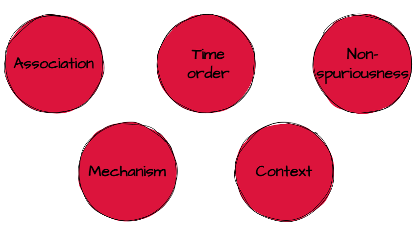
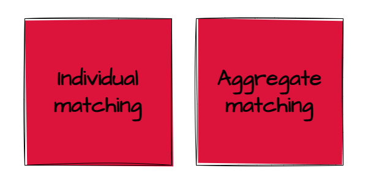
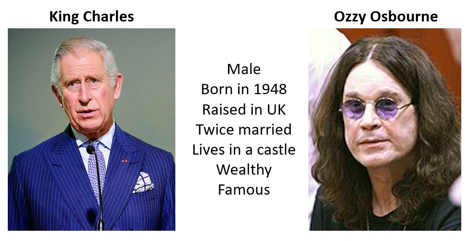
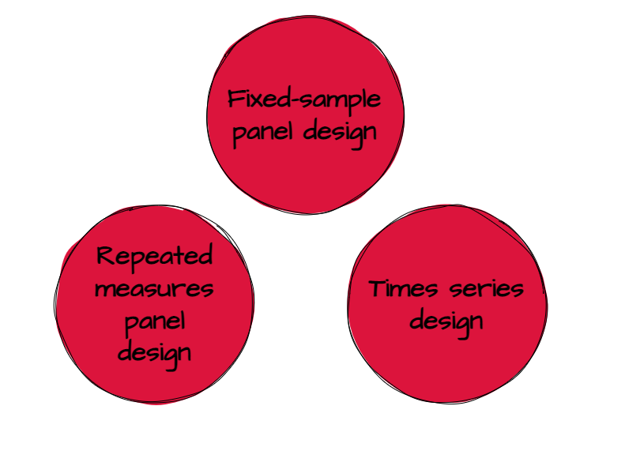
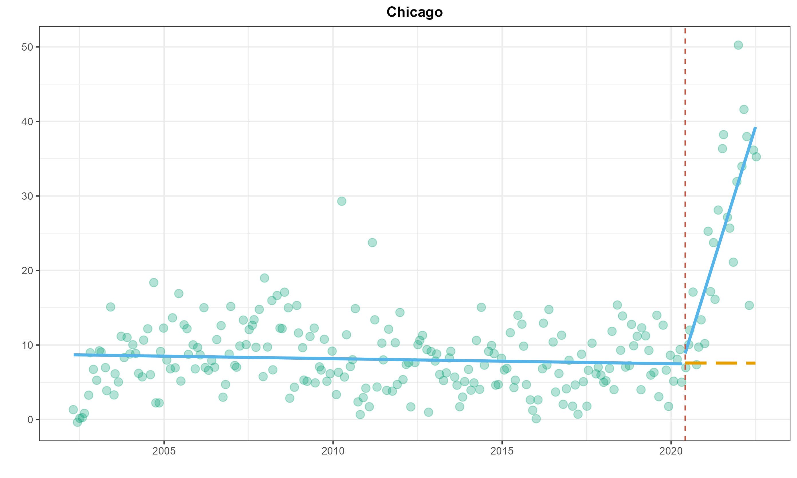
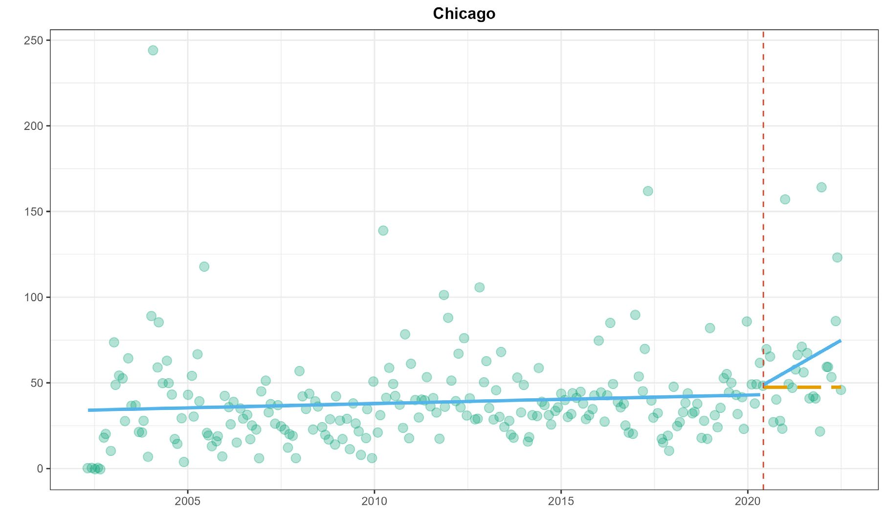
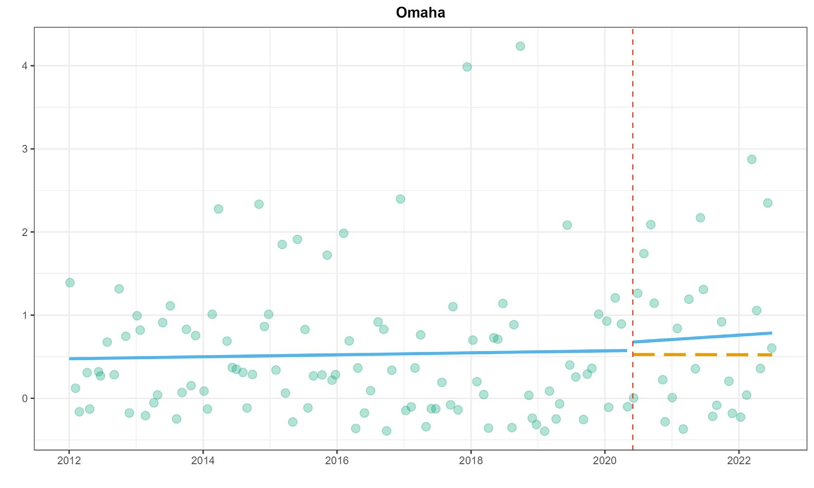
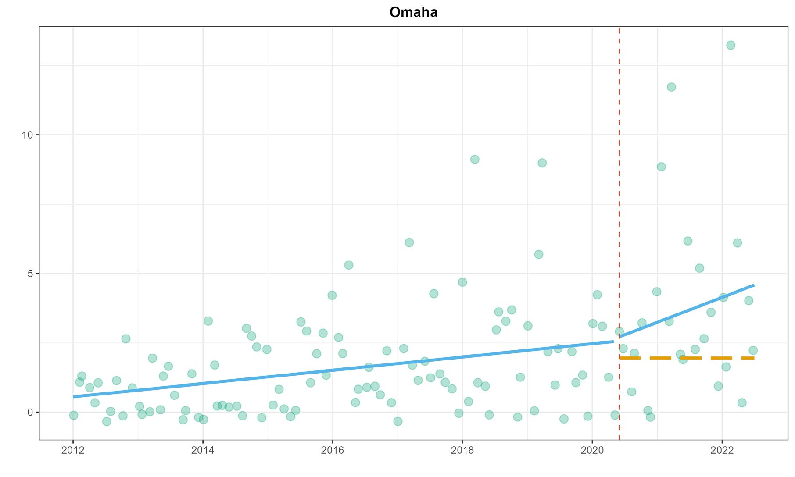

class: center, middle, inverse
background-image: url(https://www.unomaha.edu/university-communications/downloadables/campus-icon-the-o/uno-icon-color.png)
background-position: 95% 90%
background-size: 10%

# Causation and Research Design

<br>
<br>
<br>

[Justin Nix](https://jnix.netlify.app)  
*School of Criminology and Criminal Justice*  
*University of Nebraska Omaha*

<br>
<br>
<br>
<br>
<br>
.white[March 9, 2023]

---
class: middle, center, inverse

# $X$ → $Y$

???

This chapter is all about causes and effects. 

In the social sciences, demonstrating **causality** can be very difficult. We can often demonstrate that there is a relationship between $X$ and $Y$, but on its own, this is not good evidence on which to base policy. 

Consider that there is a positive relationship between where in the community police allocate their resources and crime rates. 
- Does this mean policing causes crime? 
- Or does it mean crime causes policing, i.e., police deploy their resources in response to emerging crime trends?

***What do you think we'd need to do to determine which is the correct interpretation of this relationship?***

--

## (cause) → (effect)

---
class: middle, center

# $X$ → $Y$

--

## For example...

--

## How could we test whether **exposure to violence** causes individuals to behave more **aggressively**?

---
class: top

# Causal Explanation

???

A causal effect is said to occur if variation in the IV is followed by variation in the DV *when all other things are equal*, or when *all other potentially influential factors are taken into consideration*. 

**Five criteria** must be considered when assessing causality, and we'll discuss each in turn. 

When a research design leaves one or more of the criteria unmet, this should cast doubt on whether X→Y. 

--

```{r, echo=FALSE, fig.align='center', out.width = "100%"}

```

???

The first there here are necessary. The last two aren't necessary per se, but they certainly help make the case stronger.

**Association** is necessary but not sufficient. In other words, in order for X to cause Y, X has to be correlated with Y. If changes in X do not produce changes in Y, then it is not related to Y, let alone causally related.
- But of course, association alone does not establish a *causal* relationship. 

**Time order** means that the variation in X must have preceded the observed variation in Y. That is, the cause has to come before the effect. A lot of social science research is *cross-sectional*, meaning data for X and Y are collected at the same time, therefore making it difficult, if not impossible, to establish time order. 

**Nonspuriousness** is another term for "third common causes." It might sometimes appear that X and Y are related - or even that X caused Y - when in reality, a third variable, $Z$ is causing the change in both X and Y. 
- Shoe size and academic knowledge are positively correlated in children. But this is a spurious relationship. As children get older, they gain more knowledge, and their feet grow. In this case, *Age* is the $Z$. 

**Mechanism** refers to the process that is responsible for the relationship between X and Y. 
- For instance, there appears to be an association at the individual level between poverty and delinquency, such that children who live in impoverished homes seem to be more likely to be involved in petty crime. 
  - ***Why?***
  - Some researchers argue it is low parent-child attachment, inadequate supervision, erratic discipline (Sampson & Laub 1993). 
  
**Context** is critical in the social sciences, where it is virtually impossible to claim that one independent variable is responsible for changes in a dependent variable. In other words, none of this stuff occurs in a vacuum. 
  - In this view, a "cause" is really only one of a set of interrelated factors required for the observed effect. 
  - So when relationships among varaiblse differ across geographic units, or social settings, or even between different types of individuals, we'd say there is a *contextual effect*. 

---
class: top

# Why Experiment?

--

It's the most powerful design for testing causal hypotheses

--

Distinguishing features:

--

- Two or more comparison groups (e.g., treatment vs. control)

???

We want to give one of the groups the treatment, or intervention, and withhold it from the other group (the control). If we observe some change in the treatment group, but not the control group, this is stronger evidence that the change was caused by the treatment. 

**Assuming the groups are equivalent...**

--

- **Random assignment** into groups

```{r, echo=FALSE, fig.align='center', out.width = "18%"}

```

???

Bear in mind that **random assignment** is not the same thing as **random selection**, which we discussed at length in the last chapter. 

In fact, random assignment does not help at all to ensure generalizability. Representativeness (a type of external validity) is the goal of random sampling. Random assignment help ensure internal validity by creating **equivalent comparison groups**. 

If the **only thing** that influenced selection into treatment or control was chance (i.e., the outcome of a fair coin flip), then we can rule out spurious effects. *If our groups are large enough*, any differences between the groups will gradually get smaller and smaller. 

- To illustrate why sample size is so important for randomization, let's check out this [shiny app](https://ellaudet.shinyapps.io/Random_Assignment_Creates_Comparable_Groups/).

--

- Assessment of change in $Y$ *after* $X$ has been applied

???

This obviously helps us ensure time ordering, so we can rule out *reverse causality*. 

---
class: top

# Why Experiment?

--

## Example: [Does prison classification affect inmate behavior?](https://heinonline.org/HOL/P?h=hein.journals/prsjrnl83&i=357)

.pull-left[

<p style="text-align: center">.medium[Alcatraz Island]
]

.pull-right[

<p style="text-align: center">.medium[Cell Block in Alcatraz]
]

???

***How would you test this?***

**Bench and Allen (2003)** obtained a random sample of 200 inmates admitted to Utah State Pirson who had been initially classified as maximum security
- on the basis of offense severity, length of sentence, history of criminal violence, escape history, prior institutional commitments, age, substance abuse history...

From this group of 200, half were randomly assigned to get reclassified to medium-security status. 
- So the independent variable here is security classification, and it was randomly assigned. 
- The dependent variable was the number of disciplinary infractions committed by each group. 
  - Severity of infractions was weighted.
  
***What do you think happened?***

---
class: top

# Why Experiment?

--

## Field experiment: 
## [Does prior incarceration reduce the likelihood of obtaining employment?](https://www.journals.uchicago.edu/doi/full/10.1086/374403)

```{r, echo=FALSE, fig.align='center', out.width = "50%"}

```

???

***What do you think?***

***How would you test this?***

**Devah Pager (2003)** designed an experiment:
- two teams of male applicants (one white, one black) that were matched on the basis of age, physical appearance, level of qualification, and work experience (via fake CVs).
- each team applied to over 100 jobs
- IV/treatment: one applicant from each team had a prior record, one did not. 
- DV: call backs from employers

- RESULTS: 
  - those without a prior record were more likely to be called back
  - and there were notable racial differences (34% v. 17% among white applicants; 14% v. 5% for black applicants)

---
class: top

# What if a True Experiment Isn't Possible?

???

For various reasons, it might not be possible to use an experimental design.
- Ethical concerns
- Cost prohibitive
- Insufficient time

You might still be able to design a **quasi-experiment**

- Key difference: groups are **not randomly assigned**

We'll discuss 2 types of quasi-experiments: *nonequivalent control group* designs and *before-and-after* designs

--

## Nonequivalent control group designs

```{r, echo=FALSE, fig.align='center', out.width = "80%"}

```

???

**Individual matching**: individual cases in the treatment group are matched (on observables) with similar cases in the comparison group. 

**Aggregate matching**: same idea, but at the group level. Researchers find a comparison group that has similar distributions on key variables (e.g., age, gender, race, etc.).

---
class: top

# What if a True Experiment Isn't Possible?

--

## Just remember: You can only match on *observables...*

--

```{r, echo=FALSE, fig.align='center', out.width = "80%"}

```

---
class: top

# What if a True Experiment Isn't Possible?

--

## Case study: [The effectiveness of drug courts](https://www.adacounty.id.gov/judicial-court/wp-content/uploads/sites/60/drug_court_ada_and_kootenai_co_report_7_25_05.pdf)

```{r, echo=FALSE, fig.align='center', out.width = "70%"}

```
<p style="text-align: center; color: gray">.small[[Image](https://commons.wikimedia.org/wiki/File:3D_Judges_Gavel.jpg) by [Chris Potter](https://www.flickr.com/people/86530412@N02) on Wikimedia Commons, [CC BY 2.0](https://creativecommons.org/licenses/by/2.0/)]</p>

???

**Drug courts** are an alternative to correctional prison and jail-based responses to addicted offenders and generally rely more on community-based treatment. 
- The underlying assumption is that:
  - Drug users and their drug-related crimes will increasingly clog the court system and fill our jails and prisons if we don't treat their addictions. 
- They are meant to decrease case-processing time, ease the strain of drug-related cases on the courts, and decrease jail and prison commitments of drug-related offenders. 
  - Ultimately, this should all decrease the cost of controlling drug offenders.
  
***What do you think: do drug courts reduce recidivism?***

Listwan et al. (2003) evaluated the Hamilton County Drug Court program in Cincinnati. 
- DVs: recidivism for drug-related and other offenses.
- Groups: those who participated in drug court and those who were eligible but did not participate
  - **The latter either refused treatment or were denied treatment by the drug court team.**
  
***Why might this be problematic?***

The researchers demonstrated that the groups weren't significantly different in terms of age, race, education, or prior arrests...
- But the experimental group had more women and people with prior convictions unrelated to drugs.

Results suggested that drug courts reduced recidivism for drug-related offenses, but not other offenses, for 4 years. 

---
class: top

# What if a True Experiment Isn't Possible?

--

## Before-and-after designs

--

```{r, echo=FALSE, fig.align='center', out.width = "80%"}

```

---
class: top

# What if a True Experiment Isn't Possible?

--

## Case study: [Floyd protests → More cops quitting?](https://osf.io/r9mjf/)

--

.pull-left[

<p style="text-align: center">Resignations
]

.pull-right[

<p style="text-align: center">Retirements
]

---
class: top

# What if a True Experiment Isn't Possible?

## Case study: [Floyd protests → More cops quitting?](https://osf.io/r9mjf/)

--

.pull-left[

<p style="text-align: center">Resignations
]

.pull-right[

<p style="text-align: center">Retirements
]

---
class: middle, center, inverse 

# Have a great SPRING BREAK! 😄

## (We'll resume Chapter 6 on March 21st) 

<!-- ```{css, echo=FALSE} -->
<!-- @media print { -->
<!--   .has-continuation { -->
<!--     display: block; -->
<!--   } -->
<!-- } -->
<!-- ``` -->

<style>
p.caption {
  font-size: 0.5em;
  color: lightgray;
}
</style>