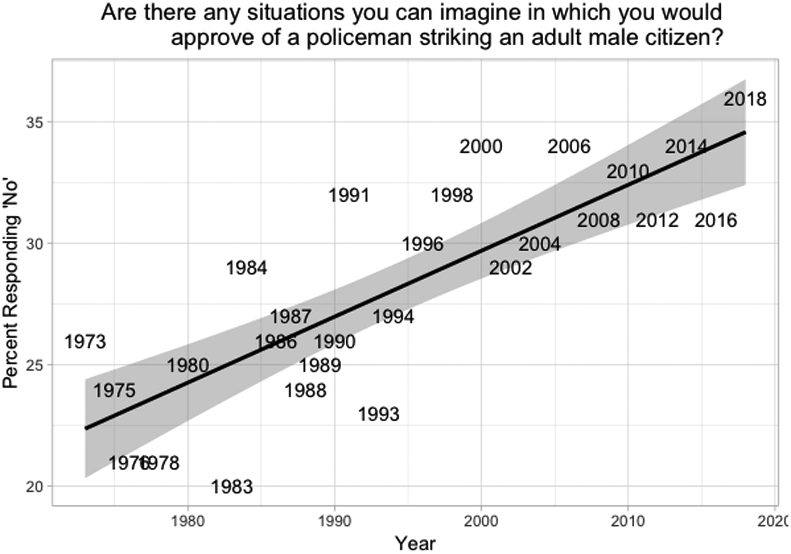

class: center, middle, inverse
background-image: url(https://www.unomaha.edu/university-communications/downloadables/campus-icon-the-o/uno-icon-color.png)
background-position: 95% 90%
background-size: 10%

# Survey Research

<br>
<br>
<br>

[Justin Nix](https://jnix.netlify.app)  
*School of Criminology and Criminal Justice*  
*University of Nebraska Omaha*

<br>
<br>
<br>
<br>
<br>
.white[October 24, 2024]

---
class: middle, center, inverse

# What Is a Survey?

---
class: top

# What Is a Survey?

```{r, echo=FALSE, fig.align='center', out.width = "75%"}
knitr::include_graphics("survey.jpg")
```
<p style="text-align: center; color: gray">.small[Image by [Scott Graham](https://unsplash.com/@homajob) on [Unsplash](https://unsplash.com/photos/OQMZwNd3ThU)]</p>

???

**Survey research** involves the collection of information from a sample of individuals through their responses to questions. 
- Used by social scientists, journalists, political pundits, and marketing researchers
- It can be an efficient method for systematically collecting data from a broad spectrum of individuals and social settings

The US Census Bureau supplements its decennial census with more frequent surveys of the population to monitor income, economics, population mobility, etc. 

In 1973, the DOJ implemented the National Crime Surveys to better understand victimizations that don't get reported to police

They're attractive because they can be very **versatile**, **efficient**, and **generalizable**. 

---
class: top

# What Is a Survey?

--

## Example of an *omnibus survey:*  [The GSS](https://gss.norc.org/)

???

Most surveys are directed at a specific research question or questions. An **omnibus survey** covers a range of topics of interest to different social scientists, and usually has multiple sponsors or is designed to generate data that would be useful to a broad segment of social science, rather than one specific RQ. 
- For example, the **General Social Survey**, administered by NORC
- Started in 1972 with funding from the NSF
- Today it is administered every 2 years as a 90-minute interview to a probability sample of ~3000 Americans
  - Includes >500 questions
- The drawback of an omnibus survey is the limited depth that can be obtained in any one area

--

<details>
  <summary>Are there any situations you can imagine in which you would approve of a policeman striking an adult male citizen?</summary>
  
  <br>

```{r, echo=FALSE, fig.align='center', out.width = "50%"}

```
<p style="text-align: center; color: gray">.small[See [Mourtgos & Adams, 2020](https://doi.org/10.1080/07418825.2019.1679864)]</p>

</details>

---
class: top

# What Is a Survey?

## Example of an *omnibus survey:*  [The GSS](https://gss.norc.org/)

<details>
  <summary>Would you ever approve of a policeman striking a citizen ... who was attacking the policeman with his fists?</summary>
  
  <br>

```{r, echo=FALSE, fig.align='center', out.width = "37%"}

```
<p style="text-align: center; color: gray">.small[See [Mourtgos & Adams, 2020](https://doi.org/10.1080/07418825.2019.1679864)]</p>

</details>

???

Since 1990, the % of respondents answering "No" to this question has **QUADRUPLED**: from approximately 5% to nearly 20%
- Legally, officers are permitted to defend themselves from an assault. 
- This paper by Mourtgos and Adams discusses the tension between legal "reasonableness" and community standards of "reasonableness."

***What do you think might explain this trend?***

---
class: middle, center, inverse

# Questionnaire Development and Assessment

---
class: top

# Questionnaire Development and Assessment

```{r, echo=FALSE, fig.align='center', out.width = "50%"}

```
<p style="text-align: center; color: gray">.small[[Image](https://flic.kr/p/bCQ66o) by [Laura Gilmore](https://flickr.com/photos/genbug/) on Flickr, [CC BY-NC-ND 2.0](https://creativecommons.org/licenses/by-nc-nd/2.0/)]</p>

--

1. Build on existing instruments  

--

2. Maintain focus  

--

3. Consider translation

---
class: middle, center, inverse

# Writing Questions

---
class: top

# Writing Questions

--

## Construct clear, meaningful questions

--

### Avoid confusing phrasing and vagueness

--

.pull-left[
*How often do you carry a method of self-protection?*
<p style="text-align: center">.large[❌]</p>
]

--

.pull-right[
***In the last month, how many days did you carry*** *a method of self-protection* ***such as pepper spray?***
<p style="text-align: center">.large[🆗]</p>
]

---
class: top

# Writing Questions

## Construct clear, meaningful questions

--

### Avoid negatives and double negatives

--

.pull-left[
*Do you disagree that juveniles should not be tried as adults if they commit murder?*
<p style="text-align: center">.large[❌]</p>
]

--

.pull-right[
***To what extent do you agree or disagree with the following statement:*** *Juveniles should be tried as adults if they commit murder.*
<p style="text-align: center">.large[🆗]</p>
]

---
class: top

# Writing Questions

## Construct clear, meaningful questions

--

### Avoid double-barreled questions

--

.pull-left[
*I believe we should stop spending so much money on policing and invest more in K-12 education.*
<p style="text-align: center">.large[❌]</p>
]

--

.pull-right[
*I believe we should stop spending so much money on policing.*

*I believe we should invest more in K-12 education.*
<p style="text-align: center">.large[🆗]</p>
]

---
class: top

# Writing Questions

## Construct clear, meaningful questions

--

### Beware of "agreement bias"

--

.pull-left[
*To what extent do you agree or disagree with the following statement: The new health care plan is worthy of support.*

*Have you ever shoplifted something from a store?*
<p style="text-align: center">.large[❌]</p>
]

--

.pull-right[
*To what extent do you support or oppose the new health care plan?*

*Have you ever taken anything from a store without paying for it?*
<p style="text-align: center">.large[🆗]</p>
]

---
class: top

# Writing Questions

--

## Additional guidelines for fixed-response questions

```{r, echo=FALSE, fig.align='center', out.width = "80%"}

```

---
class: top

# Writing Questions

--

## Combining questions into an index

--

<details>
  <summary>Single questions are prone to <b>idiosyncratic variation</b></summary>
  
  <br>

```{r, echo=FALSE, fig.align='center', out.width = "65%"}

```
<p style="text-align: center; color: gray">.small[See [Mourtgos & Adams, 2020](https://doi.org/10.1080/07418825.2019.1679864)]</p>

</details>

--

Be aware of **response sets**

--

- And remember to **reverse code** as necessary

---
class: top

# Writing Questions

--

## Demographic questions

--

What questions are **necessary?**

--

Should you put them at the beginning or end of your survey?

--

Consider ordinal measures when concerned about protecting anonymity

---
class: top

# Writing Questions

--

## Don't forget to pretest!

```{r, echo=FALSE, fig.align='center', out.width = "50%"}

```
<p style="text-align: center; color: gray">.small[[Image](https://upload.wikimedia.org/wikipedia/commons/e/e4/Allen_Iverson.jpg) by [KA Sports Photos](https://www.flickr.com/people/27003603@N00) on Wikimedia Commons, [CC BY-SA  2.0](https://creativecommons.org/licenses/by-sa/2.0/deed.en)]</p>

---
class: middle, center, inverse

# Survey Designs

---
class: top

# Survey Designs

<br>

--

.pull-left[
### Self-administered mail surveys
]  

--

.pull-right[
### Group-administered surveys
]  

--

.pull-left[
### Phone surveys
]

--

.pull-right[
### In-person interviews
]

--

.pull-left[
### Web-based surveys
]

--

.pull-right[
### Mixed-mode surveys
]

---
class: middle, center, inverse

# Ethical Issues in Survey Research

---
class: top

# Ethical Issues in Survey Research

--

<br>

## Protection of respondents

--

<br>

## Confidentiality

---
class: middle, center, inverse 

# Have a great day! 😄

```{r, echo=FALSE, fig.align='center', out.width = "45%"}
knitr::include_graphics("take-my-survey.jpg")
```


<!-- ```{css, echo=FALSE} -->
<!-- @media print { -->
<!--   .has-continuation { -->
<!--     display: block; -->
<!--   } -->
<!-- } -->
<!-- ``` -->

<style>
p.caption {
  font-size: 0.5em;
  color: lightgray;
}
</style>