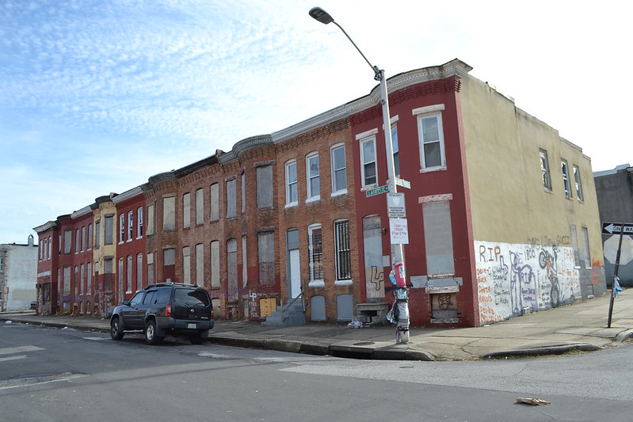
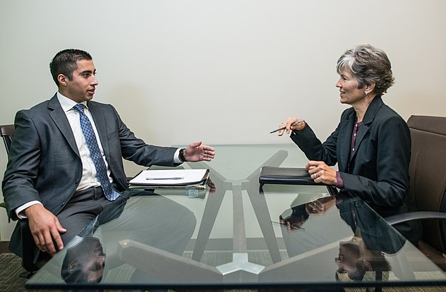
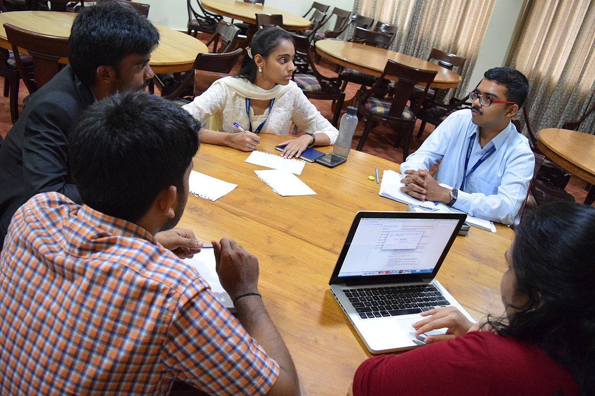
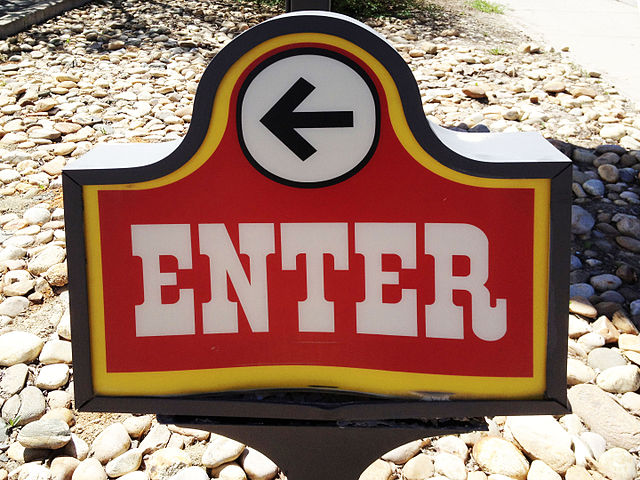
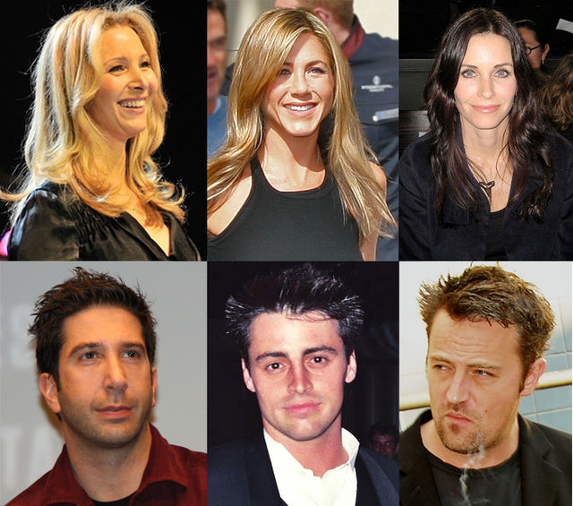
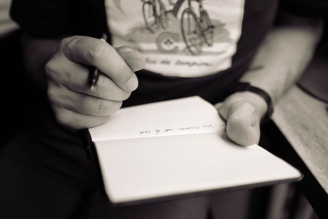

class: center, middle, inverse
background-image: url(https://www.unomaha.edu/university-communications/downloadables/campus-icon-the-o/uno-icon-color.png)
background-position: 95% 90%
background-size: 10%

# Qualitative Methods and Data Analysis

<br>
<br>
<br>

[Justin Nix](https://jnix.netlify.app)  
*School of Criminology and Criminal Justice*  
*University of Nebraska Omaha*

<br>
<br>
<br>
<br>
<br>
.white[April 6, 2023]

???

Distinctly different from Experimental and Survey designs!
-	Exploratory research questions
-	Focus on unstudied (or understudied) processes and phenomena
-	Orientation to social context and the interconnections between processes
-	Focus on human subjectivity
-	Focus on events experienced leading up to outcome
-	Reflexive research design that evolves as the project progresses
-	Sensitivity to researcher subjectivity

---
class: middle, center, inverse

# Three Distinctive Research Designs

---
class: top

# Participant Observation

???

**Participant Observation** - gathering data while developing a sustained relationship with individual or group under investigation
-	Complete observation requires minimal disruption
-	Covert participation disguises researcher agenda; no jottings or field notes
-	Increased attention paid to maintaining relationships in the field and managing personal dimension of field research
-	*Purposive sampling*
-	Systematic observation involves a standardized design reliant upon intensive record-keeping 

--

<br>
<br>

```{r, echo=FALSE, fig.align='center', out.width = "100%"}

```

---
class: top

# Participant Observation

## Complete observation

```{r, echo=FALSE, fig.align='center', out.width = "100%"}

```

--

- Michael Sierra-Arévalo (2024) - [*The Danger Imperative*](https://www.sierraarevalo.com/dangerimperative)

???

**Complete Observation** - Researcher tries to see things as they happen, without actively participating in or disrupting these events
- May be interaction with subject(s) of study
- Subjects may not be aware they are being studied 
- Common when observing specific types of events and behaviors that occur in public

**Advantages/Disadvantages of  Complete Observation**
- Will people act naturally knowing they are being watched?
- *Reactive Effects*:  people’s actions are a reaction to being studied
- Researcher does not participate in illegal, unethical, or dangerous activities, BUT
  - Researcher may observe illegal behaviors or dangerous situations. **Should the researcher report?**

---
class: top

# Participant Observation

## Participation and Observation

```{r, echo=FALSE, fig.align='center', out.width = "100%"}

```

--

- Margaret Mead (1928) - [*Coming of Age in Samoa*](https://en.wikipedia.org/wiki/Coming_of_Age_in_Samoa)

- William Foote Whyte (1943) - [*Street Corner Society*](https://en.wikipedia.org/wiki/Street_Corner_Society)

- Sudhir Venkatesh (2000) - [*American Project*](https://www.hup.harvard.edu/catalog.php?isbn=9780674008304)

???

**Participation and Observation**
Two types:
- Participate with group being studied, but make clear that you are also studying them
- Observes and interacts, but does not participate in group 

Can combine roles
- Inform some members of group about research
- Participate enough to develop rapport and gain sense of what group members experience, but people know that you are not “one of them”

**Advantages and Disadvantages of Participant and Observer Role**
- Researcher can decline to participate in unethical or dangerous activities
- Because group members know the researcher’s real role in group, they can choose to keep some information or attitudes hidden

---
class: top

# Participant Observation

## Covert participation

```{r, echo=FALSE, fig.align='center', out.width = "100%"}

```

--

- Erving Goffman (1961) - [*Asylums*](https://en.wikipedia.org/wiki/Asylums_%28book%29)

- Laud Humphreys (1970) - [*Tearoom Trade*](https://en.wikipedia.org/wiki/Tearoom_Trade)

???

**Covert (or Complete) Participation**
- Researcher operates as fully functioning member of the group or social setting 
- Most people being studied are usually not aware that they are being studied 

**Problems with Covert Participation**
- *“Going Native”* – researcher becomes so wrapped up in role that adopt not only outward trappings (e.g., clothing) but also the ideas and views of people being studied
- Cannot take notes or record conversations, must rely on memory
- Cannot ask questions that might reveal the fact that a research study is being conducted
- Must “keep up the act” as all times which is difficult and may cause emotional strain on the researcher
- Danger to researcher and others
  - If others suspect the researcher’s identity or if the researcher contributes to, or impedes, group action, these consequences can be adverse 
    - Can manipulate the group
    - Cause distrust of social scientists

**Ethical Issues with Covert Participation**
- Faced with choosing to/not to engage in illegal behavior
- Deception
  - Participation by research ‘subjects’ is not voluntary
  - Researcher must determine deception is necessary, otherwise this role cannot be justified
  - Some researchers believe that it is never justified because the deception is unethical

---
class: top

# Ethnography

???

Study of a culture or cultures that a group of people share

Can think of it as a special type of participant observation, usually done by one person as opposed to a team. 

Naturalistic
- Seeks to understand social world as it really is

Major data collection technique is “being there”

Analysis relies on thorough and insightful telling of the “story” of the culture/group being studied

Strive for objectivity

“…look for and recognize underlying assumptions, their own and those of their subjects, and to try to override the former and uncover the latter” (Anderson, 1999)

--

```{r, echo=FALSE, fig.align='center', out.width = "50%"}

```
<p style="text-align: center; color: gray">.small[Image by [Baltimore Heritage](https://www.flickr.com/photos/baltimoreheritage/) on [flickr](https://flic.kr/p/RbkGev), [CC BY 2.0](https://creativecommons.org/licenses/by/2.0/)]</p>

- James Marquart (1986) - ["Doing research in prison"](https://heinonline.org/HOL/P?h=hein.journals/jquart3&i=26)

- Peter Moskos (2008) - [*Cop in the Hood*](https://en.wikipedia.org/wiki/Cop_in_the_Hood)

- Rosa Brooks (2021) - [*Tangled Up in Blue*](https://www.washingtonpost.com/outlook/a-georgetown-professor-trades-her-classroom-for-a-police-beat/2021/02/11/15a2216a-5aa2-11eb-8bcf-3877871c819d_story.html)

---
class: top

# Intensive Interviewing

```{r, echo=FALSE, fig.align='center', out.width = "60%"}

```
<p style="text-align: center; color: gray">.small[Image by [Amtec Photos](https://www.flickr.com/people/141761303@N08/) on [Wikimedia Commons](https://upload.wikimedia.org/wikipedia/commons/thumb/8/85/Young_Man_in_a_Interview.jpg/640px-Young_Man_in_a_Interview.jpg), [CC BY-SA 2.0](https://creativecommons.org/licenses/by-sa/2.0/)]</p>

???

**Intensive Interviewing** - involves open-ended and unstructured questioning posed to uncover in-depth information regarding the respondents feelings, experiences and perceptions
-	Aims to develop a comprehensive picture of interviewee’s background, attitudes and actions in their own words
-	Saturation point emerges when new interviews yield little additional information
-	Critical that researcher establishes rapport for interviewee comfort and interview productivity
-	Recording responses must be accurate but unobtrusive

--

- Fleury-Steiner (2003) - [*Jurors' Stories of Death*](https://www.press.umich.edu/23483/jurors_stories_of_death)

---
class: top

# Focus Groups

```{r, echo=FALSE, fig.align='center', out.width = "60%"}

```
<p style="text-align: center; color: gray">.small[Image by [NSaad (WMF)](https://commons.wikimedia.org/wiki/User:NSaad_(WMF)) on [Wikimedia Commons](https://upload.wikimedia.org/wikipedia/commons/8/86/Christ_University_focus_group_6.jpg), [CC BY-SA 4.0](https://creativecommons.org/licenses/by-sa/4.0/)]</p>

???

**Focus Groups** - unstructured group interviews in which the group leader actively encourages group discussion among participants
-	Samples include recruited participants that represent target population
  - Relatively homogeneous 
- Ask specific questions & guide discussions
- Encourage all members to participate
- Information gathered is qualitative and unstructured

Several focus groups on the same topic will help check for consistency

Good for:
- discovering unanticipated findings and exploring hidden meanings
- Developing or improving survey instruments
- Identifying the range of opinion on an issue

--

- Arlie Hochschild (1997) - [*The Time Bind*](https://en.wikipedia.org/wiki/The_Time_Bind)

---
class: middle, center, inverse

# Navigating the Field

---
class: top

# Entering the Field

```{r, echo=FALSE, fig.align='center', out.width = "60%"}

```
<p style="text-align: center; color: gray">.small[Image by [Mr. Brian](https://www.flickr.com/people/53360519@N04) on [Wikimedia Commons](https://upload.wikimedia.org/wikipedia/commons/thumb/0/07/ENTER_%286967506348%29.jpg/640px-ENTER_%286967506348%29.jpg), [CC BY 2.0](https://creativecommons.org/licenses/by/2.0/)]</p>

???

Learn about the setting
- Typical clothing
- Mannerisms of studied group
- Typical activities 

Find someone to get your “foot in the door” and show you the ropes
- Vital to develop a trust relationship with at least one member of the group 

First impressions can make or break a study

---
class: top

# Developing and Maintaining Relationships

```{r, echo=FALSE, fig.align='center', out.width = "50%"}

```
<p style="text-align: center; color: gray">.small[Image by various on [Wikimedia Commons](https://upload.wikimedia.org/wikipedia/commons/thumb/3/30/Friends_actors_montage.jpg/640px-Friends_actors_montage.jpg), [CC BY-SA 3.0](https://creativecommons.org/licenses/by-sa/3.0/)]</p>

--

Don't have to be **this** close, but you need to earn trust


???

Develop plausible and honest explanation for yourself and your study

Maintain support of key individuals in setting

Don’t be too aggressive in questioning others, to the point that you violate local social norms

Don’t fake similarity with your subjects (don’t “go native”)

Avoid giving and receiving money or gifts

Be prepared for difficulties and tensions if multiple groups are involved, may be pressured to “take sides”

---
class: middle, center, inverse

# Sampling People and Events

---
class: top

# Sampling

???

Field research usually does not use probability sampling

--

## Theoretical sampling

???

**Theoretical sampling**
- Does not occur at beginning
- Researcher learns of important processes during data collection and makes certain to sample enough people to investigate fully

--

- Glaser & Strauss (1967) - [*Awareness of Dying*](https://en.wikipedia.org/wiki/Awareness_of_Dying)

- Decker & Van Winkle (1996) - [*Life in the Gang*](https://www.ojp.gov/ncjrs/virtual-library/abstracts/life-gang-family-friends-and-violence)

--

## Experience Sampling Method (ESM)

???

**Experience Sampling Method (ESM)**

- Subjects carry pagers and when paged, they fill out reports of what they are doing at the time

--

- Kuppens et al. (2010) - ["Feelings change"](https://citeseerx.ist.psu.edu/document?repid=rep1&type=pdf&doi=abd1bfb2b95599c36913bc15cde42f607d3dd11f)

- .large[😄 😡 😞 😭 😨]

---
class: middle, center, inverse

# Note-taking

---
class: top

# Taking Notes

```{r, echo=FALSE, fig.align='center', out.width = "60%"}

```

???

Primary method of recording participant observation data: **field notes**

Usually a mistake to try to take comprehensive notes while engaged in the field because it is too disruptive

Field researchers typically jot down partial notes while observing

After leaving field, researchers retreat to their computer, hand-write or dictate more complete notes on a daily basis 

---
class: top

# Writing Up Field Notes

```{r, echo=FALSE, fig.align='center', out.width = "60%"}
knitr::include_graphics("typing.jpg")
```
<p style="text-align: center; color: gray">.small[Image by [Rasheedhrasheed](https://commons.wikimedia.org/wiki/User:Rasheedhrasheed) on [Wikimedia Commons](https://upload.wikimedia.org/wikipedia/commons/thumb/7/77/Kazi_tanzania.jpg/640px-Kazi_tanzania.jpg), [CC BY-SA 4.0](https://creativecommons.org/licenses/by-sa/4.0/)]</p>

???

Field notes must be as complete, detailed, and true to what was observed and heard as possible

With the aid of the jottings and some practice, researchers usually remember a great deal of what happened
- Write comprehensive field notes immediately afterward, or at least within the next 24 hours
- Write field notes before they have been discussed with anyone else 

Usually, writing up notes takes at least three times longer than the field observation or interview did

---
class: top

# Systematic Observation

???

Use standard form on which to record observations
- Frequency of behaviors
- People observed
- Weather/environmental conditions
- Social conditions

--

Sampson & Raudenbush (1999) - ["Systematic social observation of public spaces"](https://www.journals.uchicago.edu/doi/abs/10.1086/210356)

--

- NORC researchers drive an SUV 5mph down every street in 196 Chicago census tracts

--

- Cameras on each side "captured social activities and physical features...simultaneously"

--

- Two trained observers also kept a log of what they saw
  
  - *Physical disorder:* cigarettes on ground, graffiti, abandoned cars  
  - *Social disorder:* adults loitering, intoxicated people, drug sales

--

- This method resulted in 23,816 "face blocks" observed *and* videotaped

---
class: middle, center, inverse

# Qualitative Data Analysis

???

Literally (L) – focused on literal content and form
- Text leads the dance

Reflexively (R) – focuses on how researcher’s orientation shapes interpretations and focus
- Researcher leads the dance

Interpretively (I)
- Construct own interpretation of what the text means

---
class: top

# Qualitative v. Quantitative Data Analysis

.pull-left[
**Qualitative**
]

.pull-right[
**Quantitative**
]

--

.pull-left[
Focus on meanings
]

.pull-right[
Focus on quantifying social phenomena
]

--

.pull-left[
Collect rich data from a few cases
]

.pull-right[
Collect few data from a lot of cases
]

--

.pull-left[
No pre-determined categories or directions
]

.pull-right[
Analyses, categories of data planned in advance
]

---
class: top

# Qualitative v. Quantitative Data Analysis

.pull-left[
**Qualitative**
]

.pull-right[
**Quantitative**
]

--

.pull-left[
Conclusions reflect sensitivity to the social situation being studied
]

.pull-right[
Conclusions aimed toward making generalizations
]

--

.pull-left[
Goal is rich descriptions of the social world
]

.pull-right[
Goal is valid & reliable measurement of specific variables
]

---
class: top

# Techniques of Qualitative Data Analysis

???

Documentation of the data and the process of data collection

Organization/categorization of the data into concepts

Connection of the data to show how one concept may influence another

Corroboration/legitimization, by evaluating alternative explanations and disconfirming evidence and searching for negative cases

Representing the account (reporting the findings)

--

## Documentation

???

The data for a qualitative study most often are notes jotted down in the field or during an interview—from which the original comments, observations, and feelings are reconstructed— or text transcribed from audiotapes. 

“The basic data are these observations and conversations, the actual words of people reproduced to the best of my ability from the field notes” (Diamond, 1992:7).

--

## Conceptualization, Coding, and Categorizing

???

Identifying and refining important concepts is a key part of the iterative process of qualitative research

Conceptualization may begin with a simple observation that is interpreted directly, “pulled apart” and then put back together more meaningfully

--

## Examining Relationships and Displaying Data

???

Centerpiece of the analytic process
- allows the researcher to move from simple description of the people and settings to explanations of why things happened as they did with those people in that setting. 

The process of examining relationships can be captured in a matrix that shows how different concepts are connected, or perhaps what causes are linked with what effects

--

## Authenticating Conclusions

???

No set standards exist for evaluating the validity or “authenticity” of conclusions in a qualitative study, but the need to consider carefully the evidence and methods on which conclusions are based is just as great as with other types of research. Individual items of information can be assessed in terms of at least three criteria (Becker, 1958)

--

1. How credible is the informant? 

--

2. Were statements made in response to researcher's questions, or were they spontaneous?

--

3. How does the presence/absence of the researcher influence the actions and statements of other group members? 

---
class: top

# Reflexivity

```{r, echo=FALSE, fig.align='center', out.width = "65%"}
knitr::include_graphics("transparency.jpg")
```
<p style="text-align: center; color: gray">.small[Image by [Nick Youngson](http://www.nyphotographic.com/) on [Pix4free](https://pix4free.org/photo/16458/transparency.html), [CC BY-SA 3.0](https://creativecommons.org/licenses/by-sa/3.0/)]</p>

???

Confidence in the conclusions from a field research study is also strengthened by
- honest and informative account about how the researcher interacted with subjects in the field
- problems he or she encountered
- how these problems were or were not resolved

This “natural history” of the development of the evidence enables others to evaluate the findings

---
class: middle, center, inverse

# Grounded Theory

---
class: top

# Grounded Theory

--

```{r, echo=FALSE, fig.align='center', out.width = "90%"}

```

???

Creation of grounded theory is goal of much qualitative research

Process of inductive reasoning
- Refine definitions of problems and concepts and select indicators
- Create theoretical models
- Modify models as researcher gains experience in the setting

Check models carefully against notes to discover evidence suggesting model is incorrect 

When models are not supported by data, refine the models

---
class: middle, center, inverse 

# Have a great day! 😄

```{r, echo=FALSE, fig.align='center', out.width = "60%"}
knitr::include_graphics("haiku.jpg")
```


<!-- ```{css, echo=FALSE} -->
<!-- @media print { -->
<!--   .has-continuation { -->
<!--     display: block; -->
<!--   } -->
<!-- } -->
<!-- ``` -->

<style>
p.caption {
  font-size: 0.5em;
  color: lightgray;
}
</style>