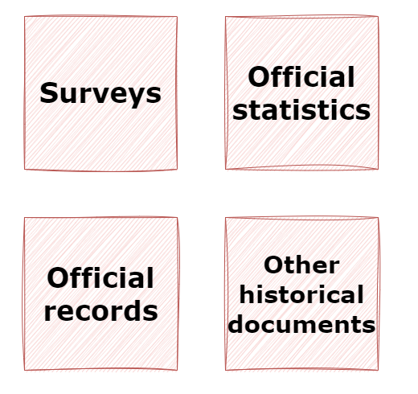
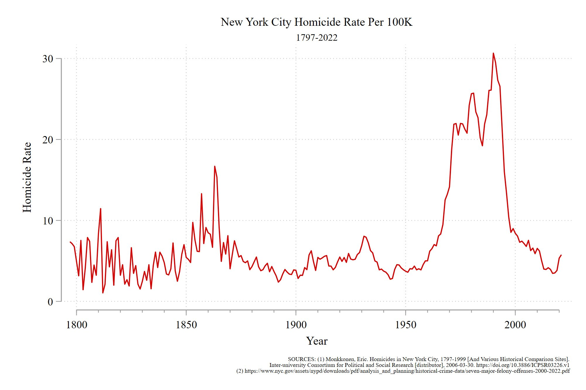
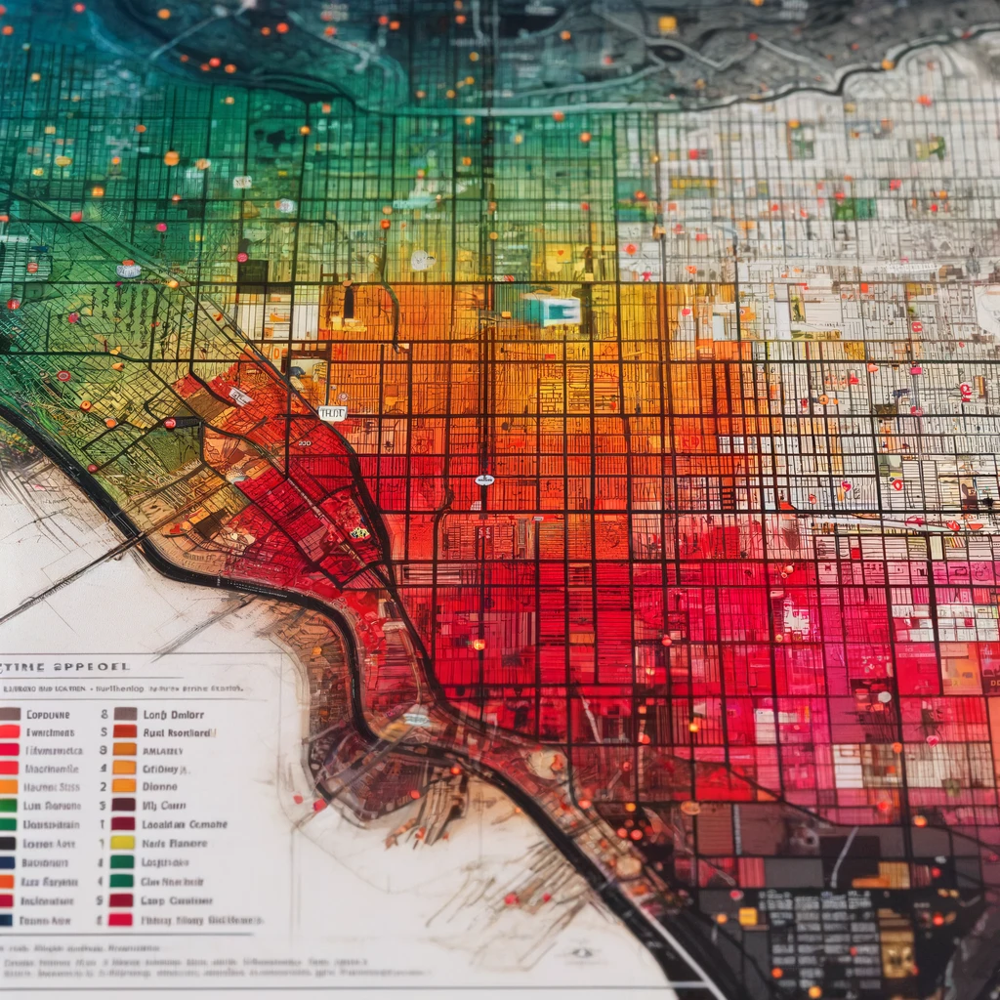

class: center, middle, inverse
background-image: url(https://www.unomaha.edu/university-communications/downloadables/campus-icon-the-o/uno-icon-color.png)
background-position: 95% 90%
background-size: 10%

# Analyzing Content

<br>
<br>
<br>

[Justin Nix](https://jnix.netlify.app)  
*School of Criminology and Criminal Justice*  
*University of Nebraska Omaha*

<br>
<br>
<br>
<br>
<br>
.white[April 11, 2024]

???

---
class: top

# What are Secondary Data?

```{r, echo=FALSE, fig.align='center', out.width = "60%"}

```


---
class: top

# What are Secondary Data?

--

Generally, four types:

--

```{r, echo=FALSE, fig.align='center', out.width = "50%"}

```

---
class: top

# What are Secondary Data?

--

Check out the University of Michigan's [ICPSR](https://www.icpsr.umich.edu/web/pages/)

```{r, echo=FALSE, fig.align='center', out.width = "50%"}

```

---
class: top

# What are Secondary Data?

--

Or browse [GitHub](https://github.com/jnixy)

```{r, echo=FALSE, fig.align='center', out.width = "50%"}

```

---
class: middle, center, inverse

# Discussion Question

## Do you think POLICE RESOURCES are allocated equitably by RACIAL/ETHNIC DISTRIBUTION and SOCIOECONOMIC STATUS?

---
class: top

# What are Secondary Data?

## Case Study

[David Thacher (2011): "The Distribution of Police Protection"]((https://link.springer.com/article/10.1007/s10940-010-9125-3)

```{r, echo=FALSE, fig.align='center', out.width = "45%"}

```

???

**Method**: matched UCR and Census data from 1970 to 2000. Included a measure of income inequality as a proxy for poverty. 

So this is a good example of using official statistics as a secondary data source. It's also a sort of historical study of sorts.

---
class: top

# What are Secondary Data?

## Case Study

[David Thacher (2011): "The Distribution of Police Protection"]((https://link.springer.com/article/10.1007/s10940-010-9125-3)

```{r, echo=FALSE, fig.align='center', out.width = "80%"}
knitr::include_graphics("thacher_t1.png")
```

???

**Key finding**: wealthier and lower-crime areas receive more police per crime. 

Crime became more concentrated in the poorest communities over these 4 decades, and as a result, police resources per crime have become less egalitarian. 

- "The result is a growing workload disparity between rich and poor jurisdictions. In rich jurisdictions, each police officer has responsibility for fewer and fewer crimes over time, while in poor jurisdictions this part oif the police workload has either remained constant or grown." (p. 289)

- Note that crime is much rarer in wealthier areas: should police spend less time in those places? 
  - How might this go over with the residents of those areas?
  - Should that matter?

Considerations...

- Can lead to **legal cynicism** in impoverished communities
- What is the **ETHICAL** responsibility of the police? Should resources be allocated equitably? What does that mean in this context? 

---
class: top

# Historical Events Research

```{r, echo=FALSE, fig.align='center', out.width = "50%"}

```

???

Historical Events research seeks to develop theoretical explanations of historical events and processes rather than offer "fact-centered" descriptions of them

--

***What do you think are some methodological challenges here?***

???

- Documents and other evidence may have been lost or damaged
- What evidence there is may be a biased sample
  - E.G., toward more newsworthy figures, or people who were more prone to writing
  - The **feelings** of people involved in past events may be hard/impossible to reconstruct

---
class: top

# Historical Events Research

## Case Study

Ohio State University's [Historical Violence Database](https://cjrc.osu.edu/research/interdisciplinary/hvd)

```{r, echo=FALSE, fig.align='center', out.width = "75%"}

```

---
class: top

# Historical Events Research

## Case Study

Eric Rise (1995): [*The Martinsville Seven*](https://www.upress.virginia.edu/title/2797/)

```{r, echo=FALSE, fig.align='center', out.width = "45%"}

```

???

In January 1949, a 32y.o. white woman in Martinsville VA accused seven young black men of violently raping her. 
- Within 2 days, state and local police had arrested and obtained confessions from each of the seven suspects.
- In brief trials held over the course of 11 days, six separate juries convicted the young men and sentenced them to death.
- In February 1951, each died by electric chair.

Eric Rise examined a ton of historical documents: legal papers that lawyers made available, official transcripts, briefs and petitions, related case law from SCOTUS, annual reports from the VA DoC, and newspaper accounts

Rise highlights the efforts of the attorneys who, rather than focusing on procedural errors, directly attacked the discriminatory application of the death penalty. 

The Martinsville Seven case was the first instance in which statistical evidence was used to prove systematic discrimination against blacks in capital cases, and it was the first time that equal protection arguments were used to challenge the constitutionality of capital punishment.

---
class: top

# Comparative Methods

```{r, echo=FALSE, fig.align='center', out.width = "50%"}

```

???

•	Comparative Methods are used by researchers interested in making often transnational connections and comparisons between entities across time and space (historical periods and geographical contexts, respectively)

--

<p style="text-align: center;">Can be <b>descriptive</b> or <b>analytic</b></p>

???

Research that seeks to understand the structure, nature, or scope of nations' criminal justice systems or rates of crime is **descriptive.**

Research that seeks to understand how national systems work and the factors related to their operations is **analytic.**

Doesn't have to be cross-national...this type of research can be used at smaller units of analysis like states and cities. 

- E.G., Dr. Richards and I published a paper looking at the effects of COVID-19 on victim help-seeking behaviors in 7 jurisdictions. We felt this was more useful than the predominant approach at the time of trying to generate nationally generalizable estimates. 

---
class: middle, center, inverse

# Discussion Question

## Do you think WAR has an effect on a nation's HOMICIDE RATE?

---
class: top

# Comparative Methods

## Case Study

Archer & Gartner (1984): [*Violence and Crime in Cross-National Perspective*](https://www.ojp.gov/pdffiles1/Digitization/105516NCJRS.pdf)

```{r, echo=FALSE, fig.align='center', out.width = "43%"}

```

???

They launched the *Comparative Crime Data File*, with extensive crime data from 110 nations and 44 major international cities, spanning 1900 to 1970

War might affect homicide rates through a number of theoretical mechanisms:

1. **Social solidarity model**: wartime will decrease violence because it increases solidarity among citizens.  
2. **Violent veteran model**: Postwar levels of violence will increase as a result of the violent acts of returning war veterans.  
3. **Legitimization of violence model:** during war, society reverses its prohibitions against killing, instead honoring acts of violence that during any other time would be considered murderous. By temporarily granting social approval of violence, there may be a lasting reduction of people's inhibitions, thereby increasing levels of violence within nations. 

The authors found that most combatant nations experienced substantial increases in their rates of homicide following both "small" and "large" wars. 

---
class: top

# Comparative Methods

## Case Study

Savage et al. (2008): ["Economic assistance and crime"](https://doi.org/10.1177/1477370807087645)

```{r, echo=FALSE, fig.align='center', out.width = "43%"}

```

???

Authors examined the relationship between social welfare spending and homicide in 52 countries.
- Does welfare spending encourage dependency and weaken personal initiative? If so, it might encourage crime.
- Or does it equalize inequities, which might be expected to reduce crime?

When looking at welfare spending across localities in the US, evidence tended to support the latter (decreased inequities, decreased crime)
- But when analyzing the **Correlates of Crime** dataset (1960-1984), they found that social welfare spending was negatively related to theft and homicide.
- In other words, as welfare spending went up, rates of those crimes generally went down. Even after controlling for other important factors like GDP and unemployment.

---
class: top

# Content Analysis

???

•	Content Analysis involves the systematic, quantitative analysis of message characteristics, with the goal being to develop inferences from text

--

## Identifying a population of documents or other textual sources

```{r, echo=FALSE, fig.align='center', out.width = "43%"}

```

???

1. Identify a population of documents or textual sources for study.

2. Determine the unit of analysis. 

3. Select a sample of units from the population.

4. Design coding procedures for the variables to be measured.

5. Test and refine the coding procedures.

6. Base statistical analyses on counting occurrences of particular items.

Keep in mind that different coders might perceive different meanings in the same text segments. So explicit coding rules are necessary to maximize consistency.

---
class: top

# Content Analysis

## Case study

Goff et al. (2008): ["Not yet human"](https://citeseerx.ist.psu.edu/document?repid=rep1&type=pdf&doi=c6027ac81ceee887cb3b6bf0bc09f66337cc46ec)

```{r, echo=FALSE, fig.align='center', out.width = "50%"}

```

???

Psychologists at Penn State and Stanford do a series of experiments showing that Americans implicitly associate Black men and apes. 
- The studies also demonstrate how this cognitive process significantly alter their judgments in criminal justice context, increasing endorsement of violence against Black suspects
- Then, in an archival study of actual capital criminal cases, they show that news articles written about Black people convicted of capital crimes are more likely to contain ape-relevant language than news articles written about White convicts
  - Further, those who are implicitly portrayed as more apelike in those articles are more likely to be executed. 
  
**Data**: death-eligible cases in Philadelphia between 1979 and 1999
- 153 cases for which the authors had mugshots and press coverage in *The Philadelphia Inquirer*

- They found 788 articles covering these cases.
- Each article was "coded for the presence of 54 words that connoted bestial or subhuman qualities"
- Words were chosen from a random sampling of 5% of the articles
- These words were then shown to 24 naive raters who read each word in its context and were asked to think of an animal that was associated with the target word in each sentence.
- 35 words elicited ape, monkey, or gorilla from more than 12 of the raters.
- Authors showed these 35 words to a new set of raters, and this time 17/24 answered ape, monkey, or gorilla.

- Ultimately, each article was scored in terms of the total number of ape words it used to describe the defendant.

---
class: top

# Crime Mapping

```{r, echo=FALSE, fig.align='center', out.width = "60%"}

```

???

Police departments have been doing "crime mapping" for 100+ years, but that's not what we're talking about today. We're talking about mapping for traditional research purposes (e.g., testing theories of criminal behavior), not mapping for investigative purposes. 

Crime mapping allows for an advanced form of statistical analysis. 

---
class: top

# Crime Mapping

## Case study

Shaw & McKay (1942) [*Juvenile delinquency and urban areas*](https://psycnet.apa.org/record/1943-00271-000)

```{r, echo=FALSE, fig.align='center', out.width = "45%"}

```

???

Shaw & McKay mapped thousands of arrests for juvenile delinquency in Chicago, using police records to determine the names and addresses of those arrested between 1927 and 1935.

They found a decrease in rates of delinquency as distance from the city center (Zone 1) increased. 
- Zone 2 had the highest rates of delinquency

"The communities with the highest rates of delinquents are occupied by these segments of the population whose position is most disadvantageous in relation to the distribution of economic, social, and cultural values...these have the fewest facilities for acquiring the economic goods indicative of status and success in our conventional culture" (pp. 318-19). 

**But keep in mind**: what do arrests as a measure of delinquency tell us? What do they not tell us? 

---
class: top

# Methodological Issues when Using Secondary Data

---
class: top

# Ethical Issues when Analyzing Available Data and Content

---
class: middle, center, inverse 

# Have a great day! 😄


<!-- ```{css, echo=FALSE} -->
<!-- @media print { -->
<!--   .has-continuation { -->
<!--     display: block; -->
<!--   } -->
<!-- } -->
<!-- ``` -->

<style>
p.caption {
  font-size: 0.5em;
  color: lightgray;
}
</style>