class: left, middle, inverse
background-image: url(https://www.unomaha.edu/university-communications/downloadables/campus-icon-the-o/uno-icon-color.png)
background-position: 95% 89%
background-size: 10%

# Police Use of Deadly Force
## What We Know and What We Need to Know

</br>
</br>

[Justin Nix](https://jnix.netlify.app)  
Distinguished Associate Professor  
School of Criminology and Criminal Justice  

<br>
<br>
<br>
.white[Curious People Series]  
.white[University of Nebraska Omaha]  
.white[April 12, 2022]

---
class: middle, center, inverse

# What Do We Know?

???

**Disclaimer**: I'm going to keep this conversation pretty high-level.

- Much of the work on this topic focuses on a single jurisdiction, or a small number of them
  - Which OTOH is great because policing predominantly takes place at the local level
  - But OTOH we can't be sure how well such findings generalize

---
class: top

## A lot more than we did before Ferguson

```{r, echo=FALSE, fig.align='center', out.width = "65%"}
knitr::include_graphics("ferguson.png")
```
<p style="text-align: center; color: gray">.small[Image by [Jamelle Bouie](https://www.flickr.com/photos/jbouie/) on [Flickr](https://flic.kr/p/oA5tcz), [CC BY 2.0](https://creativecommons.org/licenses/by/2.0/)]</p>

--

(Thanks to [WAPO](https://github.com/washingtonpost/data-police-shootings), [Fatal Encounters](https://fatalencounters.org/), and [Mapping Police Violence](https://mappingpoliceviolence.squarespace.com/)!)

???

Reporting "justifiable homicides" to the FBI is voluntary. We always knew underreporting was likely an issue, but since 2014, we've come to learn that the FBI was under counting the true number by about 50%. 

Fortunately journalists and private citizens have stepped up and provided the data

But users beware! Each uses different inclusion criteria. Read their methodology before you go using them! I've reviewed multiple papers in the last year that saw key findings change after I pointed out the need to clean and/or consider the inclusion criteria. 

---
class: top

## On average, police kill 3 people per day

--

```{r, echo=FALSE, fig.align='center', out.width = "95%"}
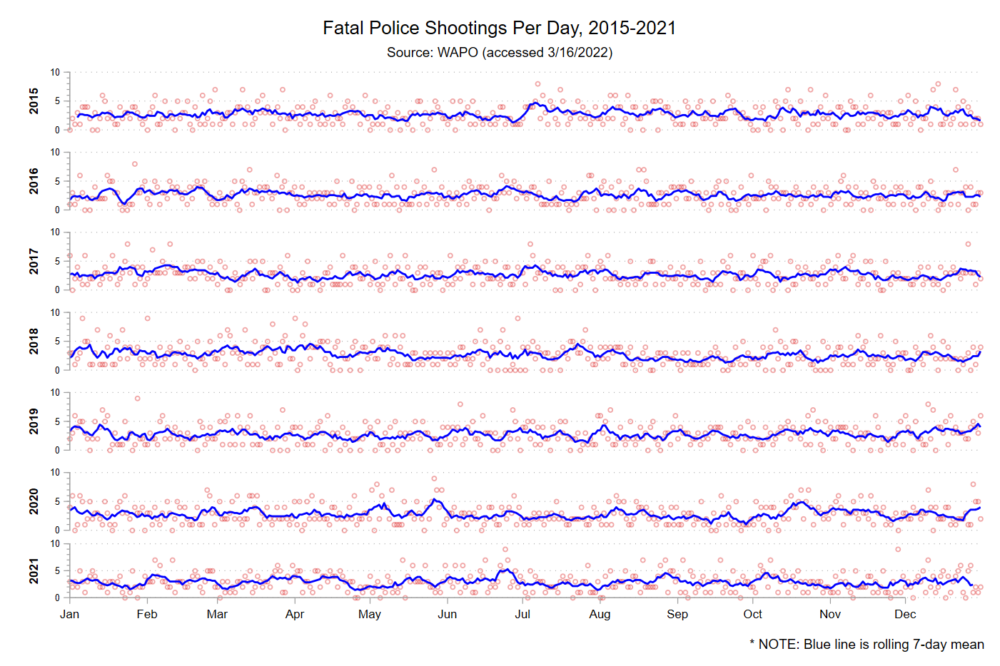
```

???

Each year, WAPO consistently tracks about 1,000 fatal police shootings (range ~950 to ~1050)

- Remarkable consistency
  - Over this period we've seen violence rise and fall
  - Debate about a "war on cops" and widespread de-policing after Ferguson and Floyd
  - A global pandemic
  - **And throughout it all, 3 people per day.**
  
  - The daily number of shootings bounces around between 0 and 9

- Nothing really jumps off the page here
  - No noticeable COVID or Floyd effect
  
---
class: top

## There are racial disparities in terms of who police kill

--

```{r, echo=FALSE, fig.align='center', out.width = "90%", fig.cap="Source: WAPO 2015-20"}
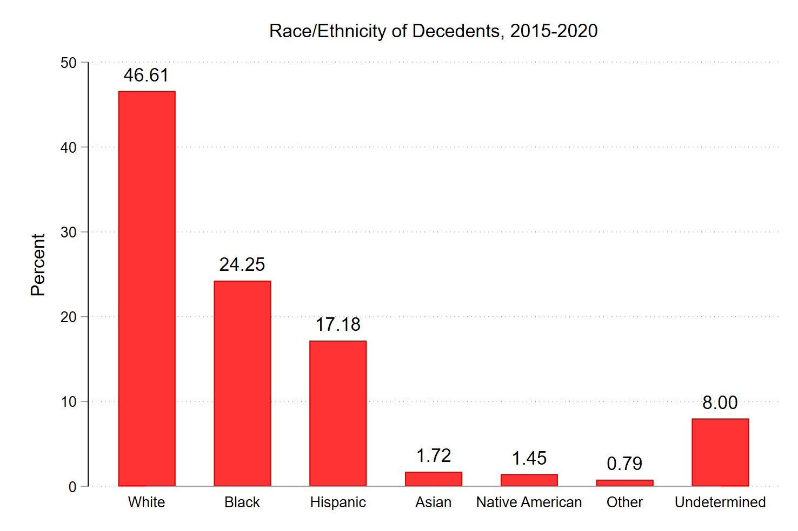
```

???

- Black people make up about 25% of police killings despite being just ~12% of the US population
- Black men face about a 1 in 1000 chance of being killed by police over the life course
- About 2.5x as likely as white men to be killed by police over the life course

---
class: top

## Police seem to kill at higher rates in the western US

--

```{r, echo=FALSE, fig.align='center', out.width = "90%", fig.cap= "Source: Schwartz & Jahn (2020)"}
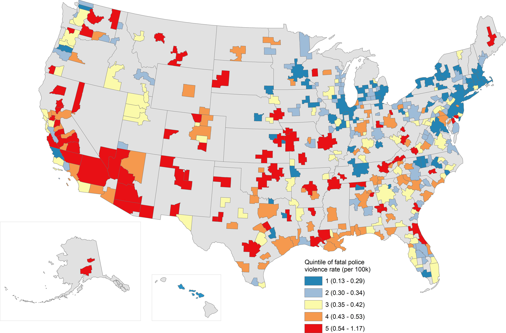
```

???

This is from Gabe Schwartz and Jacquelyn Jahn in PLOS ONE. 
- They mapped police killings in all 382 MSAs from 2013 to 2017 using data from Fatal Encounters
- This map shows each MSA's rate, color coded by quintiles
- A clear pattern is visible here

---
class: top

## ...And racial disparities vary a lot by region, too

```{r, echo=FALSE, fig.align='center', out.width = "90%", fig.cap= "Source: Schwartz & Jahn (2020)"}
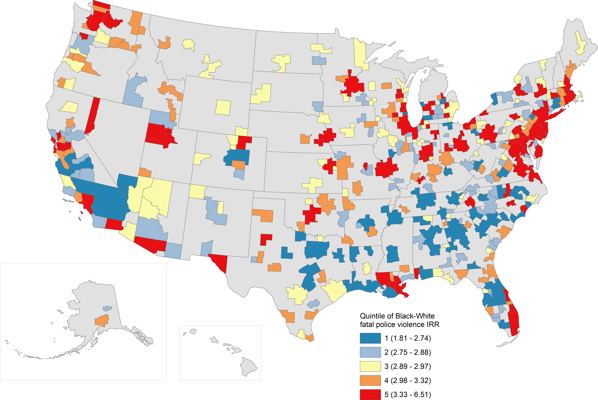
```

???

But check out how racial disparities differ by region. 
- This map shows the Black-white incidence rate ratios, again color coded by quintile
- All of the IRRs are >1, suggesting disparity.
- Black-white disparities way more pronounced in the Northeast

---
class: top

##  ...And racial disparities vary a lot by region, too

```{r, echo=FALSE, fig.align='center', out.width = "90%", fig.cap= "Source: Schwartz & Jahn (2020)"}
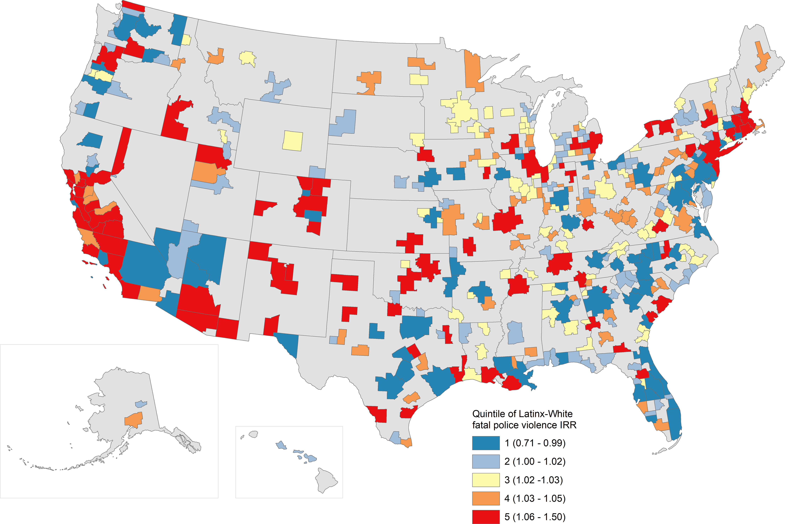
```

???

This one shows Latino-white IRRs
- Not all are >1 as in the Black-white IRRs
- And the largest disparity is 1.5 (whereas for Black-white it was 6.5)

Here, we see greater disparity in the southwest, Colorado, but also in some places in the northeast. 

---
class: top

## Those killed are overwhelmingly men

--

```{r, echo=FALSE, fig.align='center', out.width = "90%", fig.cap="Source: WAPO 2015-21"}
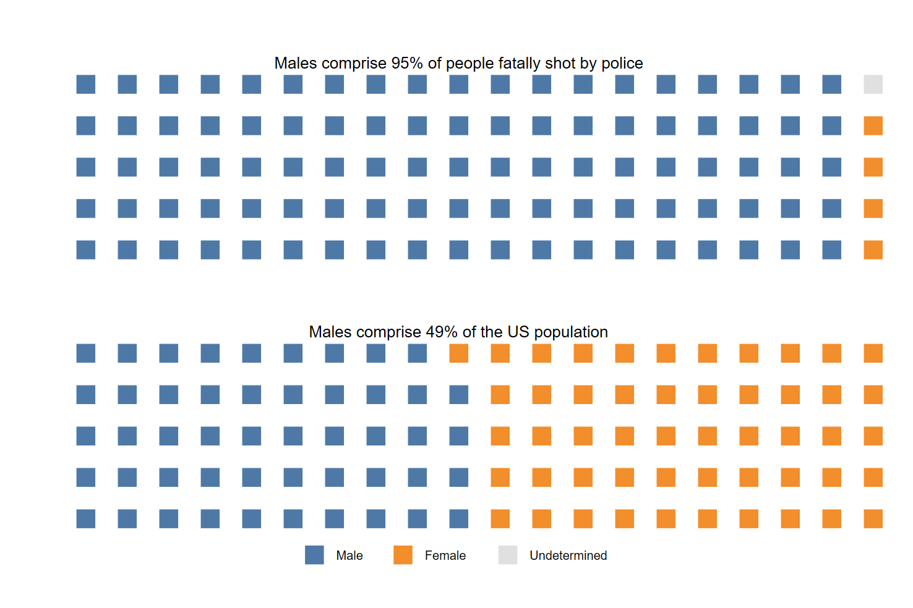
```

???

Edwards et al: Lifetime risk for men is 1 in 2,000; for women its 1 in 33,000
- Women make up about 51% of the population, but just 5% of people killed by police. 

---
class: top

## The average decedent is nearly 40

--

```{r, echo=FALSE, fig.align='center', out.width = "90%", fig.cap="Source: WAPO 2015-20"}
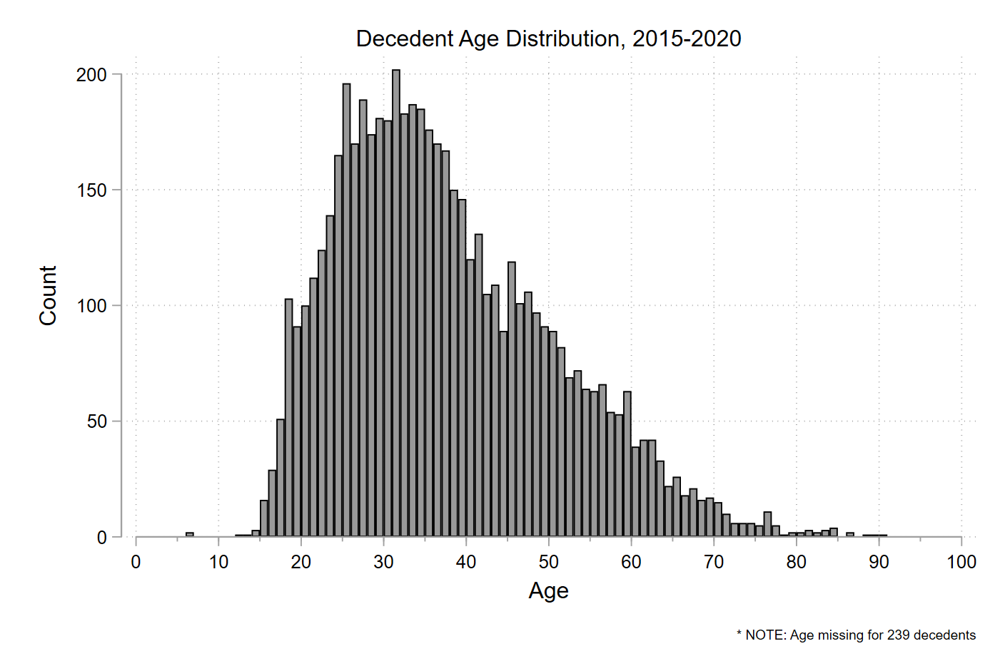
```

???

For young men between the ages of 25 and 29, police killings are a "leading cause of death" 
- 6th, behind accidents (including overdoses), suicides, homicides, heart disease, and cancer

But note that this distribution doesn't taper off until about age 40, whereas the "age-crime curve" tapers off quickly around age 25.

---
class: top

## Most decedents were armed and/or attacking officers

--

```{r, echo=FALSE, fig.align='center', out.width = "90%", fig.cap="Source: WAPO 2015-20"}
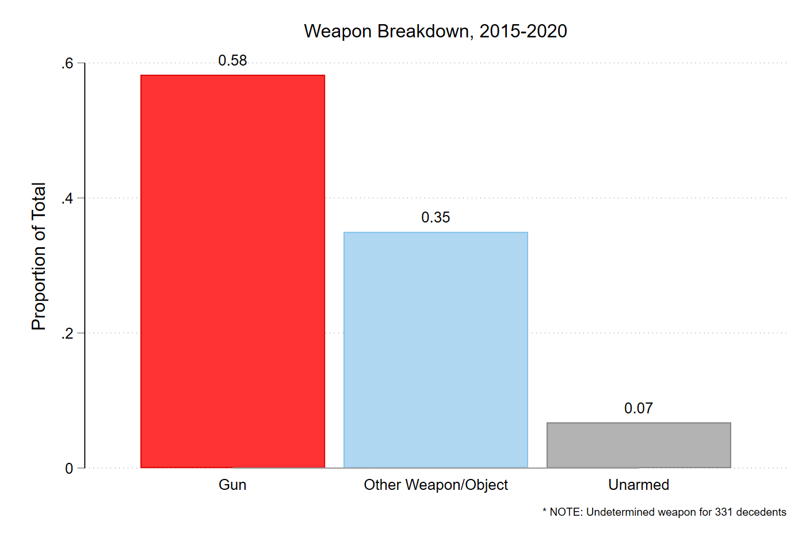
```

???

Almost 60% of those fatally shot were in possession of a firearm
- Another 35% had a knife, blunt object, or some other object
- And about 7% were unarmed

Of course a simple "armed/unarmed" dichotomy doesn't tell the whole story. 

---
class: top

## Most decedents were armed and/or attacking officers

```{r, echo=FALSE, fig.align='center', out.width = "90%", fig.cap="Source: WAPO 2015-20"}
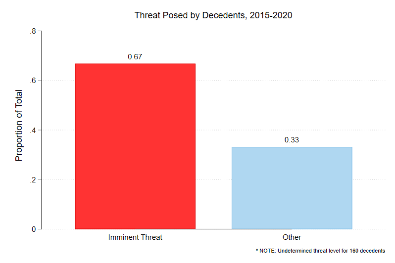
```

???

WAPO also includes a field that indicates whether a person posed an **imminent threat**
- Imminent
  - firing a gun
  - attacking with a weapon other than a gun
  - pointing/brandishing a gun
- Other
  - brandishing a knife
  - refusing to drop a non-gun weapon
  - driving a vehicle at a person
  - moving quickly/lunging at an officer without a weapon
  - furtive movements
  - fleeing
  - accidental shootings
  
We could bicker over how some of these were coded. But a lot of them are pretty clear. In any event: these data suggest about 1 in 3 people fatally shot by police didn't pose an **imminent** threat. 

---
class: top

## Most decedents were armed and/or attacking officers

```{r, echo=FALSE, fig.align='center', out.width = "90%", fig.cap="Source: WAPO 2015-20"}
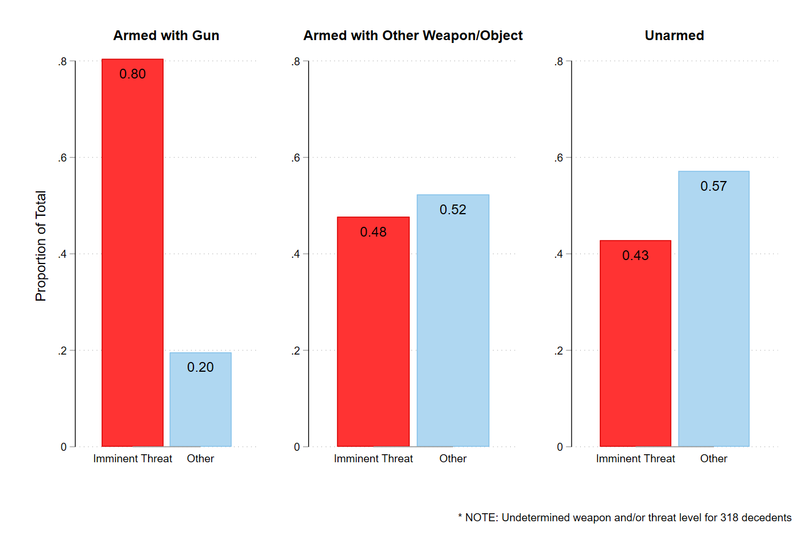
```

???

Now, look what happens when we cross-tab *weapon* and *threat*.
- 20% of those who had a gun apparently weren't pointing or shooting it.
- 52% of those with some other weapon apparently weren't attacking anyone with it.

On the flipside, note how 43% of those who were unarmed apparently still posed an imminent threat. Maybe going for the officer's gun, for example. 
- [One guy](https://www.tampabay.com/news/publicsafety/crime/hillsborough-state-attorney-clears-tampa-police-officer-in-18-year-olds/2262431/) was attempting to drown both an officer and his k9.
  - These sort of incidents are where BWCs can be very useful. Otherwise its the officer's word against the dead person's word. 

---
class: top

## About 1 in 4 decedents display signs of mental illness

--

```{r, echo=FALSE, fig.align='center', out.width = "90%", fig.cap="Source: WAPO 2015-20"}
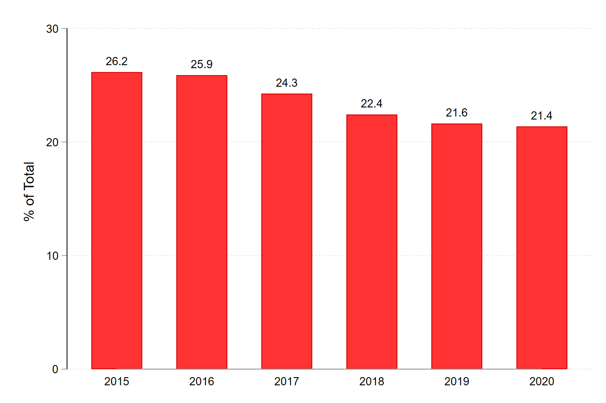
```

???

A lot has been made of the fact that 1 in 4 fatal shootings involved a person who displayed signs of mental illness. Here I've plotted the % of shootings where WAPO indicates the person had a mental illness each year, and there does appear to be an ever-so-slight downward trend. 

Two points are worth considering:
- [Lum et al. (2021)](https://journals.sagepub.com/doi/10.1177/10986111211035002) recently analyzed millions of 911 calls to nine agencies and found that calls for mental health concerns made up about 1.3% of all calls on average. They conclude that getting police out of the business of responding to mental health crises won't do much to reduce the footprint of policing. Add to this how extremely rare fatal shootings are, and that 50% of the mentally ill decedents had a gun...and I'm not as optimistic that we'll see big reductions in these specific shootings any time soon. 

- I've also worked extensively with new "official" datasets (some of which I'll discuss momentarily), and they report a much lower percentage of shootings involve mentally ill persons. I suspect agencies use a more conservative definition than the news media, and that the truth might be somewhere in the middle. 

---
class: middle, center, inverse

# What We Need Know 🤔 

---
class: top

## How often do police **use deadly force**?

--

> *The true frequency of police decisions to employ firearms as a means of deadly force...can best be determined by considering woundings and off-target shots as only fortuitous variations of fatal shootings. All are of a kind.* 

<div style="text-align: right"> - Jim Fyfe (1978) </div>

--

So our **best datasets** only provide us with a non-random sample of the outcome we seek to understand

```{r, echo=FALSE, fig.align='center', out.width = "30%", fig.cap="Image by Mike Sweeney from Pixabay"}

```

---
class: top

### Fatal shootings ≠ a random sample of deadly force incidents

--

```{r, echo=FALSE, fig.align='center', out.width = "90%", fig.cap="Source: VICE News"}
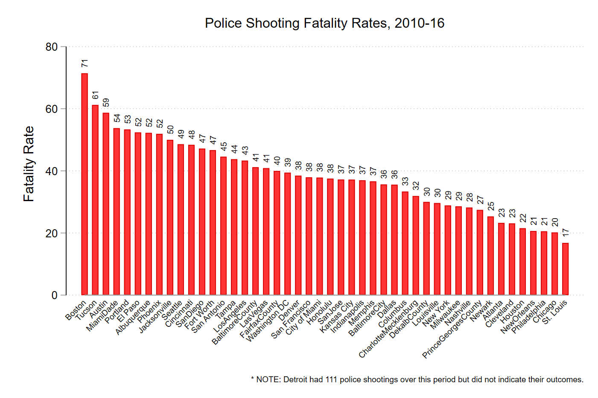
```

???

- The Detroit Police Department said it would take up to 3,120 business days and cost at least $77,532 to retrieve records that other departments made available online for free. 

---
class: top

### Fatal shootings ≠ a random sample of deadly force incidents

```{r, echo=FALSE, fig.align='center', out.width = "90%", fig.cap="Source: VICE News"}
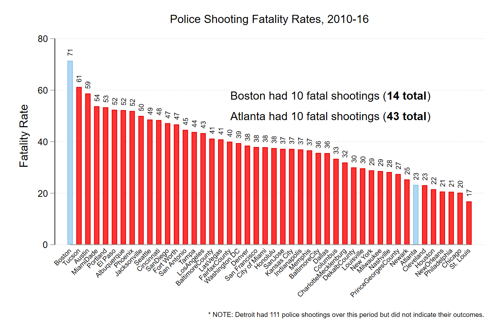
```

---
class: top

### Fatal shootings ≠ a random sample of deadly force incidents

```{r, echo=FALSE, fig.align='center', out.width = "90%", fig.cap="Source: VICE News"}
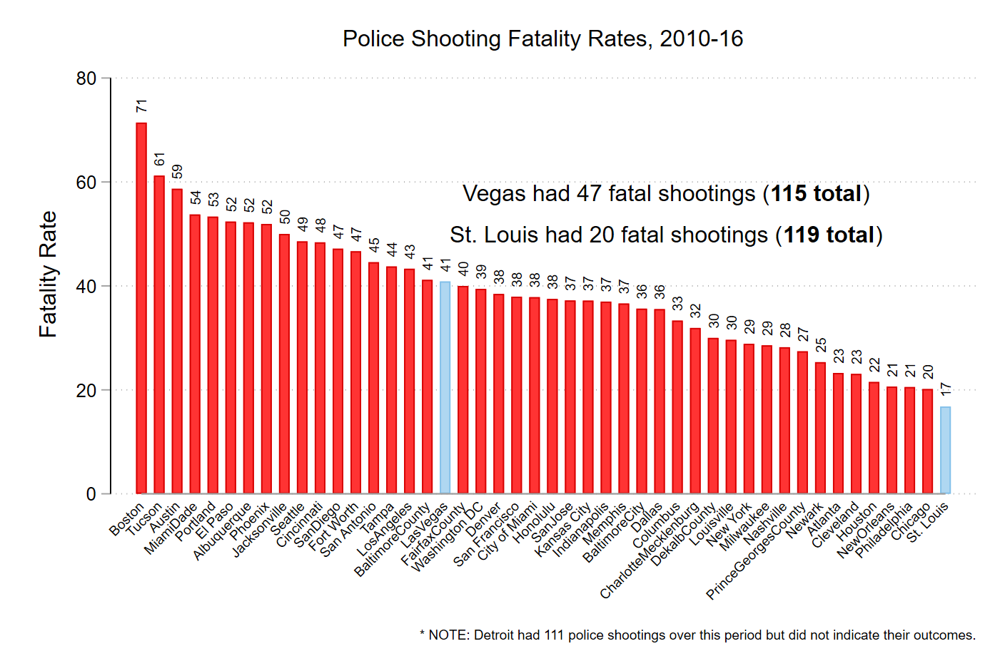
```

---
class: top

### Fatal shootings ≠ a random sample of deadly force incidents

```{r, echo=FALSE, fig.align='center', out.width = "90%", fig.cap="Source: Nix & Shjarback (2021)"}
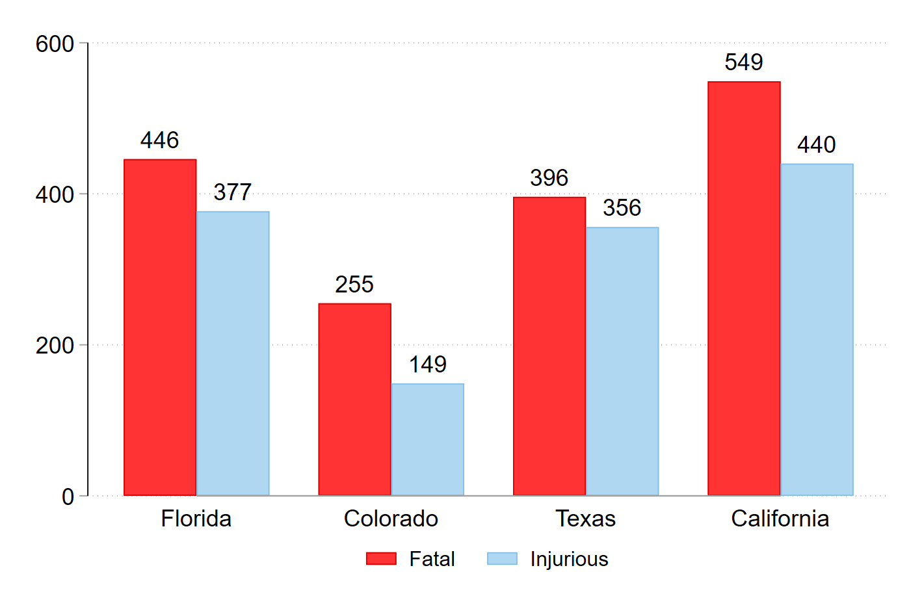
```

---
class: top

### Fatal shootings ≠ a random sample of deadly force incidents

```{r, echo=FALSE, fig.align='center', out.width = "90%", fig.cap="Source: Nix & Shjarback (2021)"}
knitr::include_graphics("pone_dot.png")
```

---
class: top

### Fatal shootings ≠ a random sample of deadly force incidents

```{r, echo=FALSE, fig.align='center', out.width = "90%", fig.cap="Source: Nix & Shjarback (2021)"}
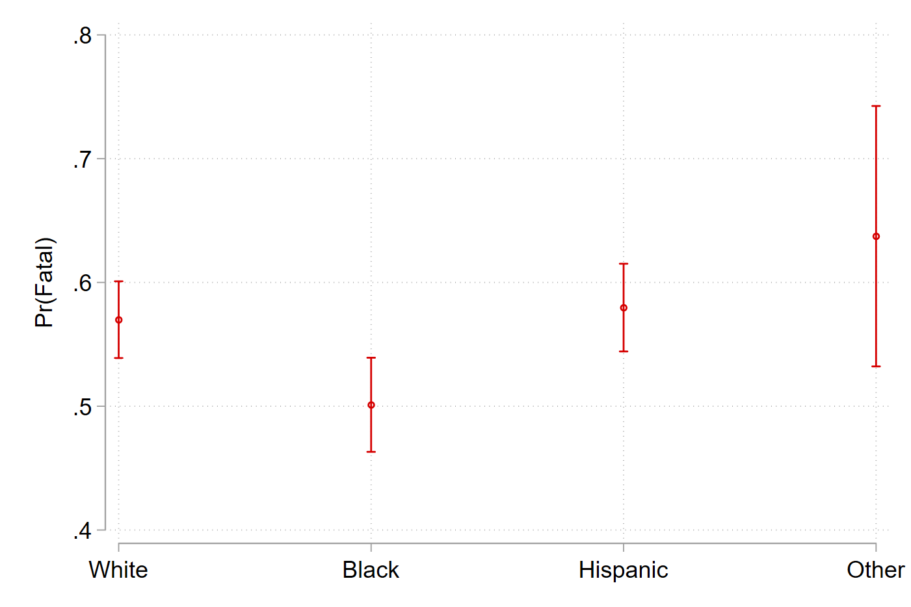
```

---
class: top

### Fatal shootings ≠ a random sample of deadly force incidents

```{r, echo=FALSE, fig.align='center', out.width = "90%", fig.cap="Source: Nix & Shjarback (2021)"}
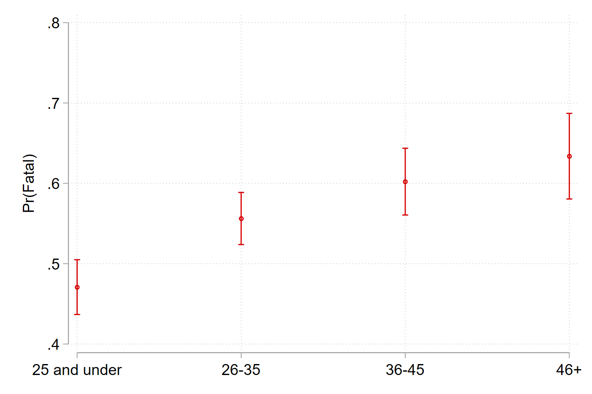
```

---
class: top

### Fatal shootings ≠ a random sample of deadly force incidents

```{r, echo=FALSE, fig.align='center', out.width = "95%", fig.cap="Source: Hou (2022, p. 122)"}
knitr::include_graphics("hou_fig10.png")
```

---
class: top

### Fatal shootings ≠ a random sample of deadly force incidents

```{r, echo=FALSE, fig.align='center', out.width = "70%", fig.cap="Source: Hou (2022, p. 123)"}
knitr::include_graphics("hou_fig11.png")
```

---
class: top

## Those tricky counterfactuals

--

```{r, echo=FALSE, fig.align='center', out.width = "75%"}

```

---
class: top

## Those tricky counterfactuals

```{r, echo=FALSE, fig.align='center', out.width = "75%"}
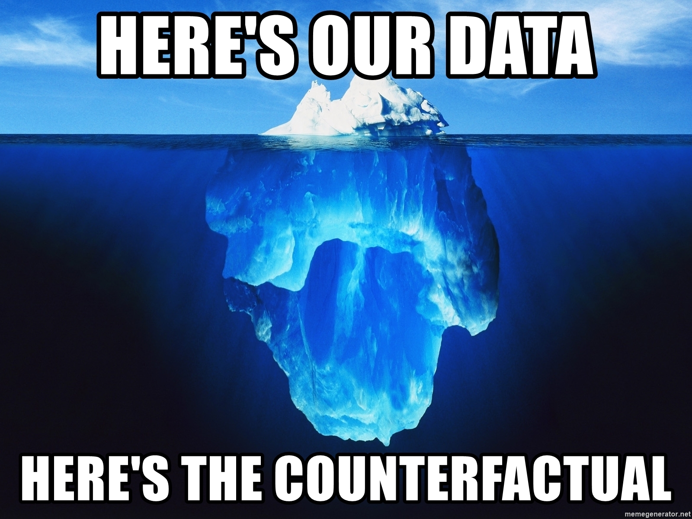
```

---
class: top

## Those tricky counterfactuals

```{r, echo=FALSE, fig.align='center', out.width = "85%"}
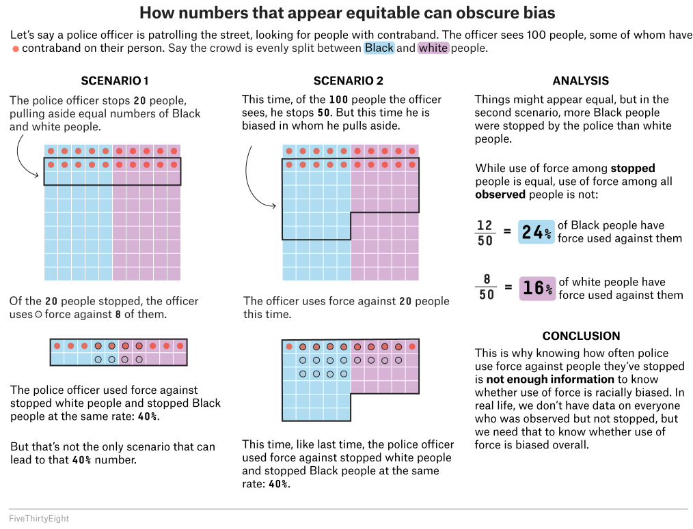
```

---
class: top

## More about the officers involved

--

Just identifying them has proven difficult

--

But beyond identifying them, we need to tease out *why* we see the variation that we do

```{r, echo=FALSE, fig.align='center', out.width = "30%"}

```

<p style="text-align: center; color: gray">.small[Image by [Stephen Carlile](https://www.flickr.com/photos/stephencarlile/) on [Flickr](https://flic.kr/p/K5Mdx), [CC BY-ND 2.0](https://creativecommons.org/licenses/by-nd/2.0/)]</p>

---
class: top

### Beware **data density bias!** (see Chalfin & Kaplan, 2021)

--

.pull-left[
```{r, echo=FALSE, fig.align='center', out.width = "100%"}
knitr::include_graphics("tweet.png")
```
]

.pull-right[
```{r, echo=FALSE, fig.align='center', out.width = "100%"}
knitr::include_graphics("tweet2.png")
```

```{r, echo=FALSE, fig.align='center', out.width = "80%"}
knitr::include_graphics("wapo_misconduct.png")
```
]

---
class: top

### The counterfactuals matter here, too

--

Officers vary in the rate at which they [stop/investigate people](https://doi.org/10.1126/science.abd8694)

```{r, echo=FALSE, fig.align='center', out.width = "75%", fig.cap = "Source: Ba et al. (2021)"}
knitr::include_graphics("ba_science.png")
```

--

As well as in their ["thresholds"](https://doi.org/10.1177%2F0002716219896553) and ability to [talk to people](https://doi.org/10.1177%2F0002716219887366)

---
class: top

## What happened **before** the "final frame?"

--

```{r, echo=FALSE, fig.align='center', out.width = "75%"}
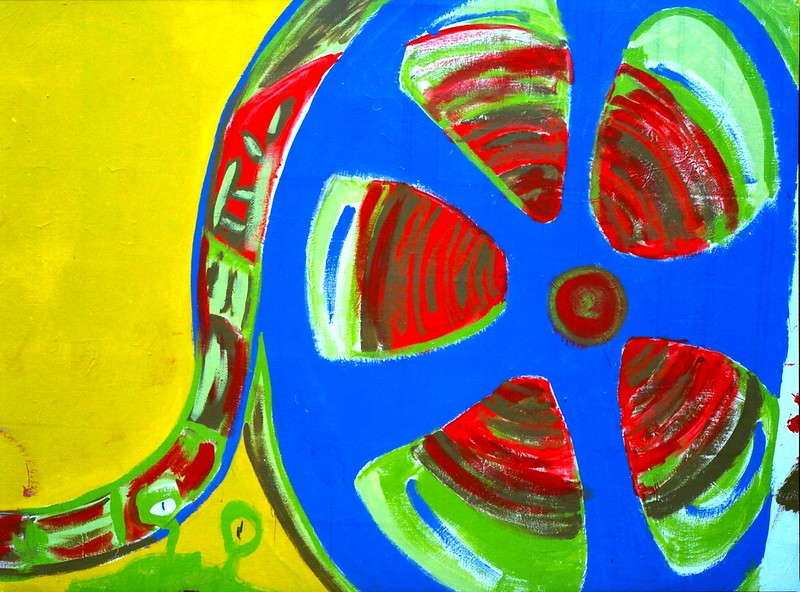
```
<p style="text-align: center; color: gray">.small[Image by [Steve Snodgrass](https://www.flickr.com/photos/stevensnodgrass/) on [Flickr](https://flic.kr/p/nJfVwE), [CC BY 2.0](https://creativecommons.org/licenses/by/2.0/)]</p>

---
class: middle, center, inverse

# What Are Some Promising Reforms?

---
class: top

## 😱📣 We need better data!

```{r, echo=FALSE, fig.align='center', out.width = "60%"}
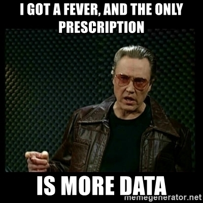
```

---
class: top

## Maybe some of what Omaha's doing?

```{r, echo=FALSE, fig.align='center', out.width = "90%", fig.cap="Source: OPD & Omaha World Herald"}
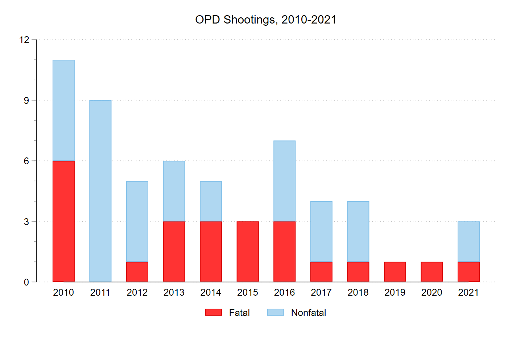
```

???

Chief Schmaderer points to BWCs, better training, mental health co-responder program, hiring more veterans from other agencies, and a culture shift.

---
class: top

## Document when officers point their guns

--

</br>

.pull-left[
```{r, echo=FALSE, fig.align='center', out.width = "100%", fig.cap= "Source: Jennings & Rubado (2017)"}
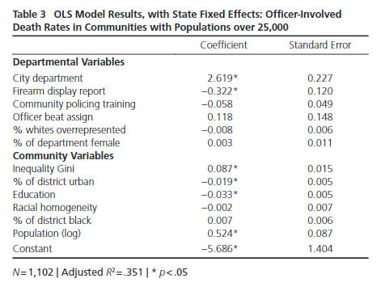
```
]

.pull-right[
```{r, echo=FALSE, fig.align='center', out.width = "100%", fig.cap= "Source: Shjarback et al. (2021)"}
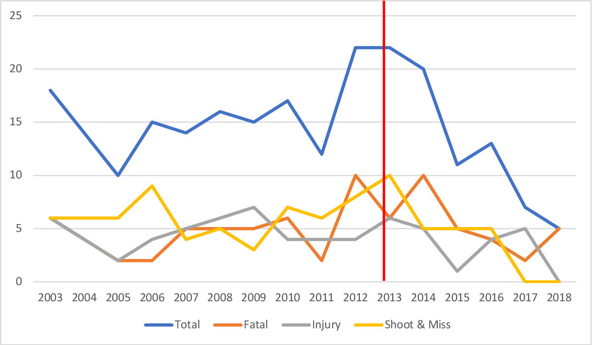
```
]

---
class: top

## Consider de-escalation training programs

--

```{r, echo=FALSE, fig.align='center', out.width = "90%", fig.cap = "Source: Engel et al. (2022)"}
knitr::include_graphics("icat.png")
```

---
class: top

## Consider de-escalation training programs

```{r, echo=FALSE, fig.align='center', out.width = "80%", fig.cap = "Source: McLean et al. (2020)"}
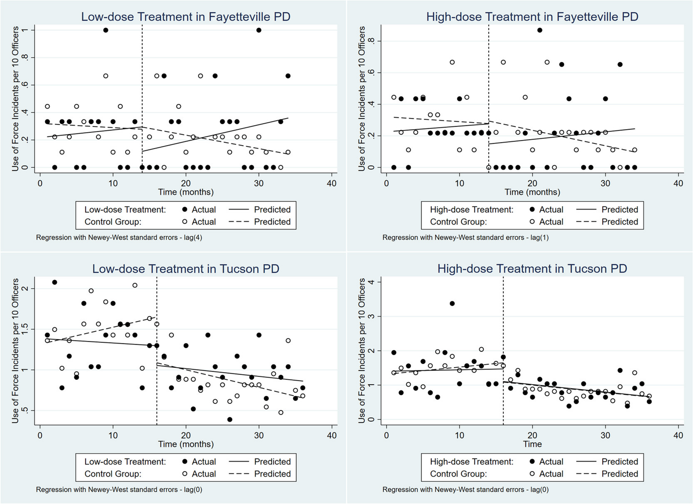
```

---
class: top

## Cut down on shootings of people who aren't brandishing or shooting a gun

--

> *Knives and blunt objects and personal attacks do not threaten the lives of police officers on either side of the Atlantic. Yet they produce lethal responses from American police hundreds of times a year. Why is this?*

<div style="text-align: right"> - Zimring (2017: 87) </div>

```{r, echo=FALSE, fig.align='center', out.width = "52%", fig.cap = "Source: FBI LEOKA"}
knitr::include_graphics("leoka.png")
```

???

- Probably can't *forbid* shooting people with knives or blunt objects, as Zimring argues...
  - Consider **Kisela v. Hughes** and the **Ma'Khia Bryant** shootings
  
- But the alternative shouldn't be to do nothing

---
class: top

## Cut down on shootings of people who aren't brandishing or shooting a gun

```{r, echo=FALSE, fig.align='center', out.width = "45%", fig.cap = "Source: Montgomery et al. (2017)"}
knitr::include_graphics("chitwood.png")
```

---
class: middle, center, inverse

# In conclusion...

---
class: middle

## It will be difficult to reduce police shootings significantly without **drastic societal changes**

--

## That said: 1,000 fatal shootings per year doesn't have to be normal

--

## The data we have, imperfect as it is, provides us with several good starting points

---
class: top, center
background-image: url(https://www.unomaha.edu/university-communications/downloadables/campus-icon-the-o/uno-icon-color.png)
background-position: 50% 59%
background-size: 10%

# Thank you!

## Questions?

Justin Nix

*School of Criminology and Criminal Justice*  
*University of Nebraska Omaha*

</br>
</br>
</br>

`r icons::fontawesome("twitter")` [jnixy](https://twitter.com/jnixy) | `r icons::fontawesome("envelope")` [jnix@unomaha.edu](mailto:jnix@unomaha.edu) | `r icons::fontawesome("globe")` [jnix.netlify.app](https://jnix.netlify.app)

</br>

`r icons::fontawesome("github")` [Replication Code](https://github.com/jnixy/replication-materials/blob/master/nix_curious_ppl_talk/curious_ppl_code.do)

---
class: top, references-font

# References/Additional Readings

Ba, B. A., Knox, D., Mummolo, J., & Rivera, R. (2021). [The role of officer race and gender in police-civilian interactions in Chicago](https://doi.org/10.1126/science.abd8694). *Science*, 371(6530), 696-702.

Bronner, L. & Mithani, J. (2020, June). [Why statistics don't capture the full extent of the systemic bias in policing](https://fivethirtyeight.com/features/why-statistics-dont-capture-the-full-extent-of-the-systemic-bias-in-policing/). *FiveThirtyEight*. 

Chalfin, A., & Kaplan, J. (2021). [How many complaints against police officers can be abated by incapacitating a few “bad apples?”](https://doi.org/10.1111/1745-9133.12542) *Criminology & Public Policy*, 20(2), 351-370.

Conley, A. (2020, July 27). [Use of force rare among Omaha police; Decrease in shootings 'impressive,' expert says](https://omaha.com/news/local/crime-and-courts/use-of-force-rare-among-omaha-police-decrease-in-shootings-impressive-expert-says/article_31f8b976-5dba-558e-89b1-61998e619e24.html). *Omaha World-Herald* (accessed 7 April 2022). 

Edwards, F., Lee, H., & Esposito, M. (2019). [Risk of being killed by police use of force in the United States by age, race–ethnicity, and sex](https://doi.org/10.1073/pnas.1821204116). *Proceedings of the National Academy of Sciences*, 116(34), 16793-16798.

Engel, R. S., Isaza, G. T., Motz, R. T., McManus, H. D., & Corsaro, N. (2021). [De-Escalation Training Receptivity and First-Line Police Supervision: Findings from the Louisville Metro Police Study](https://doi.org/10.1177%2F10986111211049834). *Police Quarterly*. (Advance online publication).

---
class: top, references-font

# References/Additional Readings

Engel, R. S., Corsaro, N., Isaza, G. T., & McManus, H. D. (2022). [Assessing the impact of de‚Äêescalation training on police behavior: Reducing police use of force in the Louisville, KY Metro Police Department](https://doi.org/10.1111/1745-9133.12574). *Criminology & Public Policy* (Advance online publication).

Federal Bureau of Investigation (2019). [*Table 28: Law Enforcement Officers Feloniously Killed by Type of Weapon, 2010-2019*](https://ucr.fbi.gov/leoka/2019/tables/table-28.xls).

Fyfe, J. J. (1978). *Shots fired: An analysis of New York City police firearms discharges*. (Unpublished doctoral dissertation). State University of New York at Albany.

Hemenway, D., Azrael, D., Conner, A., & Miller, M. (2019). [Variation in rates of fatal police shootings across US states: the role of firearm availability](https://link.springer.com/article/10.1007/s11524-018-0313-z). *Journal of Urban Health*, 96(1), 63-73.

Hou, Y. (2022). [Fatal and Non-Fatal Police Shootings in the United States, 2015: An Examination of Open-Source Data](https://www.proquest.com/docview/2632097653) (Doctoral dissertation, City University of New York).

Jennings, J. T., & Rubado, M. E. (2017). [Preventing the use of deadly force: The relationship between police agency policies and rates of officer‚Äêinvolved gun deaths](https://doi.org/10.1111/puar.12738). *Public Administration Review*, 77(2), 217-226.

---
class: top, references-font

# References/Additional Readings

McLean, K., Wolfe, S. E., Rojek, J., Alpert, G. P., & Smith, M. R. (2020). [Randomized controlled trial of social interaction police training](https://doi.org/10.1111/1745-9133.12506). *Criminology & Public Policy*, 19(3), 805-832.

Montgomery, B., Humburg, C., & Herndon, M. (2017, April). [Why cops shoot: An unprecedented review of Florida police shootings reveals how fear and bias breed confusion, how order quickly dissolves into chaos, and ways to avert the violence](https://projects.tampabay.com/projects/2017/investigations/florida-police-shootings/why-cops-shoot/). *Tampa Bay Times*. 

Nix, J., & Shjarback, J. A. (2021). [Factors associated with police shooting mortality: A focus on race and a plea for more comprehensive data](https://doi.org/10.1371/journal.pone.0259024). *PLOS ONE*, 16(11), e0259024.

Nix, J. (2020). [On the challenges associated with the study of police use of deadly force in the United States: A response to Schwartz & Jahn](https://doi.org/10.1371/journal.pone.0236158). *PLOS ONE*, 15(7), e0236158.

Riddell, J. R., & Worrall, J. L. (2021). [Predicting firearm and CEW displays as police officers' response to resistance](https://doi.org/10.1016/j.jcrimjus.2020.101775). *Journal of Criminal Justice*, 72, 101775.

Ridgeway, G. (2020). [The role of individual officer characteristics in police shootings](https://doi.org/10.1177%2F0002716219896553). *The ANNALS of the American Academy of Political and Social Science*, 687(1), 58-66.

---
class: top, references-font

# References/Additional Readings

Schwartz, G. L., & Jahn, J. L. (2020). [Mapping fatal police violence across US metropolitan areas: Overall rates and racial/ethnic inequities, 2013-2017](https://doi.org/10.1371/journal.pone.0229686). *PLOS ONE*, 15(6), e0229686.

Shjarback, J. A., White, M. D., & Bishopp, S. A. (2021). [Can police shootings be reduced by requiring officers to document when they point firearms at citizens?](http://dx.doi.org/10.1136/injuryprev-2020-043932) *Injury Prevention*, 27(6), 508-513.

Tregle, B., Nix, J., & Alpert, G. P. (2019). [Disparity does not mean bias: Making sense of observed racial disparities in fatal officer-involved shootings with multiple benchmarks](https://doi.org/10.1080/0735648X.2018.1547269). *Journal of Crime and Justice*, 42(1), 18-31.

VerBruggen, R. (2022, March). [Fatal police shootings and race: A review of the evidence and suggestions for future research](https://www.manhattan-institute.org/verbruggen-fatal-police-shootings). *The Manhattan Institute*. 

VICE News (2017, December). [Get data on nonfatal and fatal police shootings in the 50 largest U.S. police departments](https://www.vice.com/en/article/a3jjpa/nonfatal-police-shootings-data). 

---
class: top, references-font

# References/Additional Readings

Wheeler, A. P., Phillips, S. W., Worrall, J. L., & Bishopp, S. A. (2017). [What factors influence an officer’s decision to shoot? The promise and limitations of using public data](https://doi.org/10.1177%2F1525107118759900). *Justice Research and Policy*, 18(1), 48-76.

Wolfe, S., Rojek, J., McLean, K., & Alpert, G. (2020). [Social interaction training to reduce police use of force](https://doi.org/10.1177%2F0002716219887366). *The ANNALS of the American Academy of Political and Social Science*, 687(1), 124-145.

Worrall, J. L., Bishopp, S. A., Zinser, S. C., Wheeler, A. P., & Phillips, S. W. (2018). [Exploring bias in police shooting decisions with real shoot/don’t shoot cases](https://doi.org/10.1177%2F0011128718756038). *Crime & Delinquency*, 64(9), 1171-1192.

Zimring, F. (2017). *When police kill*. Cambridge, MA: Harvard University Press.

- See my short review [here](http://transformativestudies.org/wp-content/uploads/10.3798tia.1937-0237.1730.pdf)


<!-- ```{css, echo=FALSE} -->
<!-- @media print { -->
<!--   .has-continuation { -->
<!--     display: block; -->
<!--   } -->
<!-- } -->
<!-- ``` -->

<style>
p.caption {
  font-size: 0.5em;
  color: gray;
}
</style>