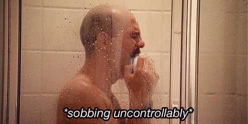

class: center, middle, inverse
background-image: url(https://www.unomaha.edu/university-communications/downloadables/campus-icon-the-o/uno-icon-color.png)
background-position: 50% 79%
background-size: 10%

# What is Good Research?
## Advice on How to Find and Make Sense of Scientific Evidence

</br>

## [Justin Nix](https://jnix.netlify.app)  
## University of Nebraska Omaha

</br>
</br>

 
.white[May 2022]

---
class: top
background-image: url(https://static.wixstatic.com/media/f5df24_6755bbd35fac4ae09d0d8227126d091f~mv2.jpg/v1/fill/w_2396,h_1192,al_c,q_90/f5df24_6755bbd35fac4ae09d0d8227126d091f~mv2.webp)
background-position: 50% 65%
background-size: 97%

# The Hierarchy of Evidence 

---
class: top

# Where to Look 👀

--

[Google Scholar](https://scholar.google.com/) is my go-to

--

- Set up alerts for keywords and authors

--

- Check for non-paywalled versions

--

  - Can't find any?
  
      - Inter-library loan  
      - Email the corresponding author and ask!

--

Other places:

--

- [JSTOR](https://www.jstor.org/)

--

- [ResearchGate](https://www.researchgate.net/)

--

- [CrimRxiv](https://www.crimrxiv.com/), [SocArXiv](https://osf.io/preprints/socarxiv/)

---
class: middle, center

# How to Screen

--

## If you search "police legitimacy," Google Scholar returns ~36,000 results

--

## ...since 2018!

--

</br>

## Disclaimer: The tips that follow are not foolproof

---
class: top

# How to Screen

--

## 1. Was it peer-reviewed?

--

"No" doesn't necessarily mean you shouldn't read it

- Pre-prints, dissertations, and book chapters can be informative

--

## 2. What journal?

--

Consider things like the field and *impact factor*

--

- [Google Scholar](https://scholar.google.com/citations?view_op=top_venues&hl=en&vq=soc_criminologycriminallawpolicing) and [SCI Journal](https://www.scijournal.org/categories/social-sciences) provide ranked lists by fields and sub-fields

---
class: top

# How to Screen

--

## 3. How many citations?

--

*Can be* an indicator of quality

--

If you're doing a lit review, be sure to click "Cited by" in Google Scholar

--

## 4. Who wrote it?

--

You'll begin to recognize various "experts"

--

- Or at least people who have a track record of doing solid work
  
--

- Though if it's Alpert, double-check he had a good team around him 🤣

---
class: middle, center

# OK, you've decided what goes in the "read" and "don't read" piles

--


## Now how are you ever going to read all this stuff?

--

\*Whispers\* You don't actually have to read it all

---
class: top

# How to Read

--

## 1. Read the Abstract

--

It's good practice to read all the abstracts in each new issue of the journals you follow

--

## 2. Skim over the "Discussion" or "Conclusion"

--

Good ones will do the following:

--

- Reiterate the importance of the issue

--

- Summarize the big-picture findings
  
  - And why they matter in practical/real-world terms

--

- Identify limitations and next steps for researchers
  
---
class: top

# How to Read

--

## 3. Look at the Tables and Figures

--

Pay attention to:

- Sample size

--

- Direction and size of coefficients

--

- *Others?*
  
---
class: top

# How to Read

--

## 4. Skim the "Methods" sections if you need more clarification

--

Things like:

--

- Research design and setting
  
  - Cross-sectional or longitudinal?  
  - Comparison group?
  - *Others?*

--

- Inclusion/exclusion criteria  

--

- How missing data were handled  

--

- *Others?*

---
class: top

# How to Read

--

## 5. If necessary, read the "Intro" and "Lit Review" sections

--

If it's your first time reading about a theory or program, bump this up to #2 (at least initially)

--

- As you become more familiar, much of the information covered here will be redundant

--

  - And remember you've got to get through your pile!

---
class: top, center

# Did I miss something?

## Let me know!

**Justin Nix**  
School of Criminology and Criminal Justice  
University of Nebraska Omaha

`r icons::fontawesome("twitter")` [jnixy](https://twitter.com/jnixy)  
`r icons::fontawesome("envelope")` [jnix@unomaha.edu](mailto:jnix@unomaha.edu)  
`r icons::fontawesome("globe")` [jnix.netlify.app](https://jnix.netlify.app)

<!-- ```{css, echo=FALSE} -->
<!-- @media print { -->
<!--   .has-continuation { -->
<!--     display: block; -->
<!--   } -->
<!-- } -->
<!-- ``` -->

